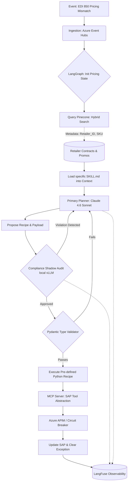

# Architecture Spec: CPG Agentic AI Exception Management System (Product 1.0)

**Document Owner:** Principal AI Systems Architect  
**Domain:** Consumer Packaged Goods (CPG) Supply Chain (Order-to-Cash)  
**Status:** Product 1.0 (Production Ready)  
**Scope:** V1.0 is strictly constrained to **Pricing & Promotional Exceptions**.

---

## 1. Abstract Solution Architecture

This system acts as an intelligent, event-driven orchestration layer sitting above legacy enterprise systems (SAP, Manhattan WMS). To ensure enterprise-grade reliability and compliance, it abandons the traditional "autonomous free-thinking agent" model in favor of a **"Modular Skill-Recipe Sandwich Architecture"**. 

In this model, non-deterministic Large Language Model (LLM) reasoning is tightly constrained:
* **Top Guardrail:** Deterministic vector retrieval (RAG) and structured progressive disclosure (`SKILL.md`).
* **Middle:** Cloud-based reasoning core (Claude 4.6 Sonnet).
* **Bottom Guardrail:** A localized, high-speed "Compliance Shadow" auditor and strictly typed, hardcoded Python execution "Recipes".

### Core Innovations:
1. **Pivot to Recipe from Rules:** Plain Rules (static, fragile, and often hallucinated by LLMs) to Recipes (deterministic, pre-validated, and modular) represents a shift toward "Expert-in-the-Loop" automation.
2.  **The Skill-Recipe Decoupling:** SKILLS.md acts as the Brain (orchestrating which tools to use), while Recipes act as the Muscle (the exact, unchangeable logic for a business process). The AI does not write code or guess API parameters. The **Brain** (`SKILL.md`) maps user intent to a specific **Muscle** (a predefined Python Recipe like `PriceAdjustmentRecipe.py`).
e.g.  Skill: "When you see a price mismatch > 3%, explain it to the user and ask to apply the PriceAdjustment recipe."
      Recipe: A hard-coded Python script that calculates the delta, checks the SAP/ERP condition types, and executes the POST request.
3.  **The Compliance Shadow:** A secondary AI layer dedicated exclusively to auditing the primary AI's proposed solutions against Retailer Penalty Matrices before execution.
4.  **Event-Driven State Machine:** Predictable, cyclical LangGraph workflows prevent infinite agent loops and ensure 100% path predictability.

---

## 2. System Architecture & Technical Stack

The application is deployed as a suite of containerized microservices on Microsoft Azure. Image builds are optimized for high-performance data center environments, utilizing `uv pip` for rapid, deterministic Python environment resolution on Ubuntu 24.04 base images.

### Infrastructure & Deployment Stack

| Component | Technology | Rationale / Description |
| :--- | :--- | :--- |
| **Cloud Provider** | Azure Kubernetes Service (AKS) | Hosts the LangGraph runner, MCP servers, and UI in isolated, scalable pods. |
| **Inference Hardware** | Intel Xeon Sapphire Rapids | Dedicated AKS node pools using Advanced Matrix Extensions (AMX) for low-latency, localized shadow inferencing. |
| **Event Ingestion** | Azure Event Hubs | Captures high-throughput exception events (e.g., EDI 850) from SAP gateways. |
| **API Gateway** | Azure API Management (APIM) | Enforces the "Circuit Breaker" pattern, rate-limiting, and payload buffering. |
| **Security** | Azure Workload Identity | Pods authenticate via temporary tokens; no hardcoded API keys in environment variables. |

### Application & AI Stack

| Layer | Technology | Rationale / Description |
| :--- | :--- | :--- |
| **Reasoning Core** | Claude 4.6 Sonnet | Azure AI Foundry deployment. Acts as the primary planner and intent router. |
| **Orchestration** | LangGraph (Python) | Manages state transitions and cyclical workflows for the exception lifecycle. |
| **Logic Layer** | `SKILL.md` framework | Progressive disclosure files that load domain-specific rules only when needed. |
| **Memory / RAG** | Pinecone (Serverless) | Hybrid Search (BM25 + Dense) ensures exact SKU/Order matching alongside semantic contract retrieval. |
| **Compliance Shadow** | Llama 3.1 8B + vLLM | Localized model served directly on AKS/Intel AMX for zero-latency penalty auditing. |
| **Guardrails** | Pydantic + Outlines | Forces strict type-checking on execution payloads before triggering Recipes. |
| **Integration Protocol** | Model Context Protocol (MCP)| Wraps SAP/ERP endpoints into standardized, self-describing tool servers. |
| **Observability** | LangFuse | Self-hosted on AKS for granular tracing of LLM prompts, tool execution, and state transitions. |

---

## 3. Detailed Data Flow (The Exception Lifecycle)

## 4. Key Design Decisions
A. The "Skill-Recipe" Decoupling
We explicitly reject the paradigm of LLMs generating execution code dynamically.

SKILL.md: Acts as the cognitive playbook. It lives in the prompt and teaches the LLM how to categorize a discrepancy.

Recipes: Pure, immutable Python functions (e.g., CreditHoldReleaseRecipe.py). The LLM merely extracts parameters to feed into these functions, ensuring 100% deterministic interaction with the SAP condition technique (e.g., mapping to condition type YK07).

B. High-Performance Localized Compliance
Sending every intermediate validation step to a cloud LLM introduces unacceptable P99 latency. By deploying the "Compliance Shadow" as a PyTorch model served via vLLM directly on the AKS cluster's Intel Sapphire Rapids nodes, we leverage Advanced Matrix Extensions (AMX). This achieves sub-200ms latency for compliance checks and keeps sensitive penalty matrices strictly within the Azure VPC.

C. Advanced RAG ETL Pipeline
Standard semantic chunking destroys the integrity of CPG promotional tables. Before documents enter Pinecone, they are processed through an intelligent ETL pipeline (using Unstructured) that preserves tabular hierarchies. Hybrid Search guarantees that specific identifiers (like SKU-12345) are never hallucinated or mismatched during retrieval.

D. The Circuit Breaker & HITL Fallback
Deployed at the API Gateway level (Azure APIM). If the automated state machine attempts to execute more than 50 pricing updates in a 5-minute window, or if the total dollar variance of an execution batch exceeds $10,000, the Circuit Breaker trips. Execution halts, and the state transitions to a React-based UI for Human-in-the-Loop (HITL) approval, preventing runaway systemic errors.

E. LangFuse over LangSmith for Self-Hosted Forensics
LangFuse was selected for its robust self-hosting capabilities on Kubernetes. This ensures no proprietary supply chain data leaves the Azure environment. Every transaction logs a deterministic TraceID, allowing operations teams to instantly see the RAG chunks retrieved, the SKILL.md utilized, and the Shadow Agent's approval reason.