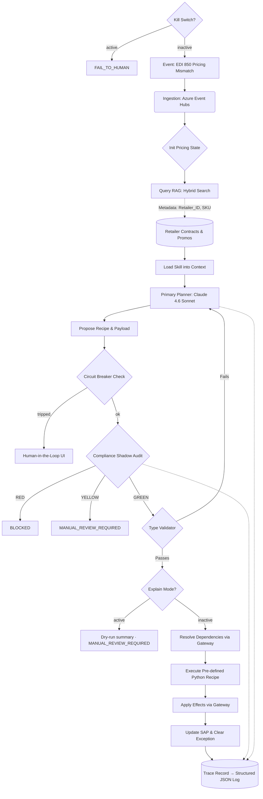
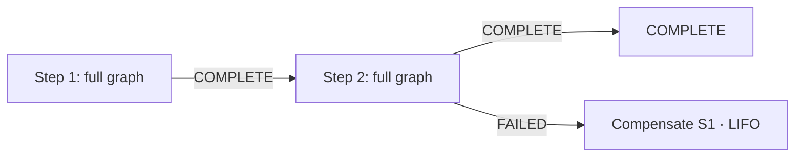

# Architecture Spec: CPG Agentic AI Exception Management System (Product 1.0)

**Document Owner:** Principal AI Systems Architect
**Domain:** Consumer Packaged Goods (CPG) Supply Chain (Order-to-Cash)
**Scope:** V1.0 is strictly constrained to **Pricing & Promotional Exceptions**.
**Design Reference:** [DESIGN.md](DESIGN.md) — maps these patterns to concrete modules, classes, and wiring.

---

## 1. Abstract Solution Architecture

This system acts as an intelligent, event-driven orchestration layer sitting above legacy enterprise systems (SAP, Manhattan WMS). To ensure enterprise-grade reliability and compliance, it abandons the traditional "autonomous free-thinking agent" model in favor of a **"Modular Skill-Recipe Sandwich Architecture"**.

In this model, non-deterministic Large Language Model (LLM) reasoning is tightly constrained:
* **Top Guardrail:** Deterministic vector retrieval (RAG) and structured progressive disclosure (Skill definitions).
* **Middle:** Cloud-based reasoning core (Claude 4.6 Sonnet).
* **Bottom Guardrail:** A localized, high-speed "Compliance Shadow" auditor and strictly typed, hardcoded Python execution "Recipes".

### Core Innovations:
1. **Pivot to Recipe from Rules:** Plain Rules (static, fragile, and often hallucinated by LLMs) to Recipes (deterministic, pre-validated, and modular) represents a shift toward "Expert-in-the-Loop" automation.
2. **The Skill-Recipe Decoupling:** Skills act as the Brain (orchestrating which tools to use), while Recipes act as the Muscle (the exact, unchangeable logic for a business process). The AI does not write code or guess API parameters. The **Brain** (Skill) maps user intent to a specific **Muscle** (a predefined Python Recipe).
   e.g. Skill: "When you see a price mismatch > 3%, explain it to the user and ask to apply the PriceAdjustment recipe."
   Recipe: A hard-coded Python script that calculates the delta, checks the SAP/ERP condition types, and executes the POST request.
3. **The Compliance Shadow:** A secondary AI layer dedicated exclusively to auditing the primary AI's proposed solutions against Retailer Penalty Matrices before execution.
4. **Event-Driven State Machine:** Predictable, cyclical LangGraph workflows prevent infinite agent loops and ensure 100% path predictability.

---

## 2. System Architecture & Technical Stack

The application is deployed as a suite of containerized microservices on Microsoft Azure, split into three containers (core orchestration, UI, LLM inference). Image builds use fast, deterministic Python dependency resolution on Ubuntu 24.04 base images.

### Infrastructure & Deployment Stack

| Component | Technology | Rationale / Description |
| :--- | :--- | :--- |
| **Cloud Provider** | Azure Kubernetes Service (AKS) | Hosts the LangGraph runner, MCP servers, and UI in isolated, scalable pods. |
| **Inference Hardware** | Intel Xeon Sapphire Rapids | Dedicated AKS node pools using Advanced Matrix Extensions (AMX) for low-latency, localized shadow inferencing. |
| **Event Ingestion** | Azure Event Hubs | Captures high-throughput exception events (e.g., EDI 850) from SAP gateways. |
| **API Gateway** | Azure API Management (APIM) | Enforces the "Circuit Breaker" pattern, rate-limiting, and payload buffering. |
| **Security** | Azure Workload Identity | Pods authenticate via temporary tokens; no hardcoded API keys in environment variables. |

### Application & AI Stack

| Layer | Technology | Rationale / Description |
| :--- | :--- | :--- |
| **Reasoning Core** | Claude 4.6 Sonnet | Azure AI Foundry deployment. Acts as the primary planner and intent router. |
| **Orchestration** | LangGraph (Python) | Manages state transitions and cyclical workflows for the exception lifecycle. |
| **Logic Layer** | Skill definition framework | Progressive disclosure files that load domain-specific rules only when needed. |
| **Policy** | Centralized policy module | Single source of truth for all business thresholds (discounts, circuit breaker limits, roles). |
| **Constrained Generation** | Three-tier backend chain | Custom backend → Outlines → Deterministic fallback. Ensures machine-consumed outputs (intents, verdicts, recipe selection) are schema-constrained at generation time. |
| **Infrastructure Gateways** | Hexagonal Architecture | Protocol-based gateway layer with timeout-enforced executor. Recipes declare dependencies/effects; orchestration mediates. Stub adapter for testing. |
| **Workflow Runner** | Saga pattern | Multi-step workflow execution. Each step runs the full graph. LIFO compensation on failure. |
| **Hardening** | Env-var switches | Kill switch halts all execution. Explain mode runs full pipeline read-only, returns dry-run summary. Both activate at call time, no restart needed. |
| **Memory / RAG** | Pinecone (Serverless) | Hybrid Search (BM25 + Dense) for SKU/Order matching and semantic contract retrieval. Currently stubbed. |
| **Compliance Shadow** | Llama 3.1 8B + vLLM | Target: localized model on AKS/Intel AMX for zero-latency penalty auditing. Currently uses deterministic fallback. |
| **Guardrails** | Pydantic + Outlines | Forces strict type-checking on execution payloads before triggering Recipes. |
| **Integration Protocol** | Model Context Protocol (MCP) | Target: wraps SAP/ERP endpoints into self-describing tool servers. Currently stubbed. |
| **Observability** | Structured JSON logging | Trace records (Pydantic, LangFuse-aligned) emitted via stdlib logging. Captures intent, shadow verdict, recipe, gateway calls, and terminal status per execution. |
| **Secret Management** | Azure Key Vault CSI | Secrets mounted to pods via Workload Identity. No hardcoded credentials. |

---

## 3. Detailed Data Flow (The Exception Lifecycle)

### Multi-Step Workflow (Saga Pattern)

When a business scenario requires chained operations (e.g., duplicate PO check followed by price adjustment), the workflow runner sequences steps:

Each step runs the full graph independently (its own shadow audit, its own recipe). On failure at step N, declared compensation recipes for steps 1..N-1 are invoked in reverse order.

---

## 4. Key Design Decisions

### A. The "Skill-Recipe" Decoupling
We explicitly reject the paradigm of LLMs generating execution code dynamically.

**Skills** act as the cognitive playbook. They live in the prompt and teach the LLM how to categorize a discrepancy.

**Recipes** are pure, immutable Python functions. The LLM merely extracts parameters to feed into these functions, ensuring 100% deterministic interaction with the SAP condition technique.

### B. High-Performance Localized Compliance
The Compliance Shadow runs as a secondary auditor that evaluates every proposed recipe execution against retailer penalty matrices. The interface produces typed verdicts: GREEN (proceed), YELLOW (escalate), RED (halt). Target state: Llama 3.1 8B served via vLLM on AKS Intel Sapphire Rapids (AMX) nodes for sub-200ms latency, keeping penalty matrices within the Azure VPC.

### C. Advanced RAG ETL Pipeline
Standard semantic chunking destroys the integrity of CPG promotional tables. Before documents enter Pinecone, they are processed through an intelligent ETL pipeline (using Unstructured) that preserves tabular hierarchies. Hybrid Search guarantees that specific identifiers (like SKU-12345) are never hallucinated or mismatched during retrieval.

### D. The Circuit Breaker & HITL Fallback
Deployed at the API Gateway level. If the automated state machine attempts to execute more than the configured maximum pricing updates in a time window, or if the total dollar variance of an execution batch exceeds the configured threshold, the Circuit Breaker trips. Execution halts, and the state transitions to a Human-in-the-Loop (HITL) approval UI, preventing runaway systemic errors.

### E. Structured Observability (LangFuse-Aligned)
Every graph execution emits a trace record as structured JSON via stdlib logging. Fields are aligned to the LangFuse trace schema (trace_id, intent, shadow verdict, recipe, gateway calls, terminal status) so a future LangFuse handler can forward records with minimal adaptation. No LangFuse package dependency exists today — stdlib logging is the single emit point, keeping the system self-host friendly and auditable from day one.

### F. Externalized Policy
All business thresholds live in a single centralized policy module. This includes discount caps, SAP condition types, authorized roles, credit exposure tolerance, circuit breaker limits, and discrepancy thresholds. Recipes and orchestration nodes import from this module; no threshold is hardcoded elsewhere. Evolution path: module constants → env vars → K8s ConfigMap → policy service.

### G. Hexagonal Gateway Pattern
Recipes never call external systems directly. Instead, recipe specs declare dependencies (data needed pre-execution) and effects (writes to apply post-execution) as typed tuples. The orchestration layer resolves dependencies before recipe execution and applies effects after, both mediated by a gateway executor with per-call timeout enforcement. All calls are logged with trace_id correlation. A stub adapter satisfies the same protocol, enabling full graph execution in tests without network access.

### H. Operational Hardening
Two env-var switches provide coarse-grained production safety:
- **Kill switch**: halts all automation before any node runs. Returns FAIL_TO_HUMAN. No LLM calls, no recipes.
- **Explain mode**: runs the full reasoning pipeline (classify → shadow → select recipe → validate types) but stops before recipe execution. Returns a dry-run summary with MANUAL_REVIEW_REQUIRED. Shadow and circuit breaker protections remain active.

Both are evaluated at call time — no restart needed.

---

## 5. Execution Invariants (Non-Negotiable)

The following invariants are enforced by code, not configuration. Violating them requires modifying and re-reviewing source code.

| # | Invariant |
|---|---|
| 1 | No recipe runs unless the Compliance Shadow verdict is GREEN |
| 2 | No recipe runs unless the recipe name is in the allowed set |
| 3 | No recipe runs unless all required parameters are non-null |
| 4 | Compliance trace_id propagates to execution log unchanged |
| 5 | Graph state forbids untyped fields — no ad-hoc data enters the state machine |
| 6 | Kill switch check precedes all node execution |
| 7 | Explain mode suppresses only recipe execution; shadow always runs |
| 8 | Recipe executor has no audit, enforce, or classify methods |
| 9 | Skill definitions are loaded verbatim — no summarisation or rewriting |
| 10 | All constrained outputs are validated by Pydantic before state advances |
