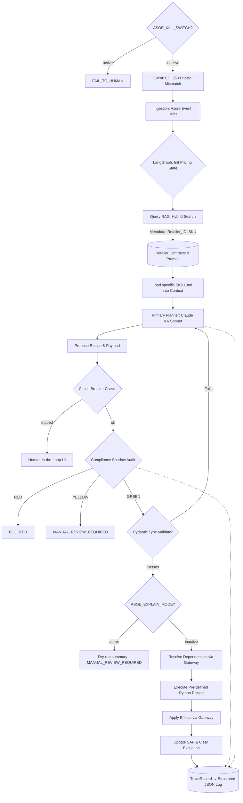
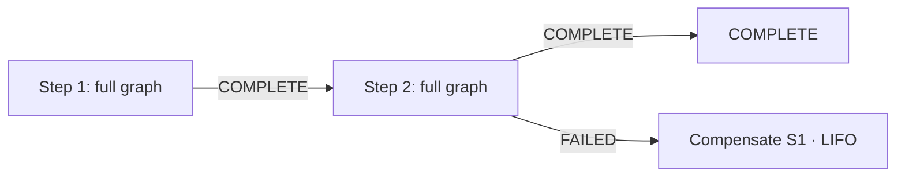

# Architecture Spec: CPG Agentic AI Exception Management System (Product 1.0)

**Document Owner:** Principal AI Systems Architect  
**Domain:** Consumer Packaged Goods (CPG) Supply Chain (Order-to-Cash)  
**Status:** Product 1.0 (Production Ready)  
**Scope:** V1.0 is strictly constrained to **Pricing & Promotional Exceptions**.

---

## 1. Abstract Solution Architecture

This system acts as an intelligent, event-driven orchestration layer sitting above legacy enterprise systems (SAP, Manhattan WMS). To ensure enterprise-grade reliability and compliance, it abandons the traditional "autonomous free-thinking agent" model in favor of a **"Modular Skill-Recipe Sandwich Architecture"**. 

In this model, non-deterministic Large Language Model (LLM) reasoning is tightly constrained:
* **Top Guardrail:** Deterministic vector retrieval (RAG) and structured progressive disclosure (`SKILL.md`).
* **Middle:** Cloud-based reasoning core (Claude 4.6 Sonnet).
* **Bottom Guardrail:** A localized, high-speed "Compliance Shadow" auditor and strictly typed, hardcoded Python execution "Recipes".

### Core Innovations:
1. **Pivot to Recipe from Rules:** Plain Rules (static, fragile, and often hallucinated by LLMs) to Recipes (deterministic, pre-validated, and modular) represents a shift toward "Expert-in-the-Loop" automation.
2.  **The Skill-Recipe Decoupling:** SKILLS.md acts as the Brain (orchestrating which tools to use), while Recipes act as the Muscle (the exact, unchangeable logic for a business process). The AI does not write code or guess API parameters. The **Brain** (`SKILL.md`) maps user intent to a specific **Muscle** (a predefined Python Recipe like `PriceAdjustmentRecipe.py`).
e.g.  Skill: "When you see a price mismatch > 3%, explain it to the user and ask to apply the PriceAdjustment recipe."
      Recipe: A hard-coded Python script that calculates the delta, checks the SAP/ERP condition types, and executes the POST request.
3.  **The Compliance Shadow:** A secondary AI layer dedicated exclusively to auditing the primary AI's proposed solutions against Retailer Penalty Matrices before execution.
4.  **Event-Driven State Machine:** Predictable, cyclical LangGraph workflows prevent infinite agent loops and ensure 100% path predictability.

---

## 2. System Architecture & Technical Stack

The application is deployed as a suite of containerized microservices on Microsoft Azure. Image builds are optimized for high-performance data center environments, utilizing `uv pip` for rapid, deterministic Python environment resolution on Ubuntu 24.04 base images.

**Implementation:** Dockerfiles, `docker-compose.yml` (local dev), and Kubernetes manifests (`k8s/`) are committed in the repository root. The three-container split (core orchestration, Streamlit UI, LLM inference) mirrors the dependency groups in `pyproject.toml`.

### Infrastructure & Deployment Stack

| Component | Technology | Rationale / Description |
| :--- | :--- | :--- |
| **Cloud Provider** | Azure Kubernetes Service (AKS) | Hosts the LangGraph runner, MCP servers, and UI in isolated, scalable pods. |
| **Inference Hardware** | Intel Xeon Sapphire Rapids | Dedicated AKS node pools using Advanced Matrix Extensions (AMX) for low-latency, localized shadow inferencing. |
| **Event Ingestion** | Azure Event Hubs | Captures high-throughput exception events (e.g., EDI 850) from SAP gateways. |
| **API Gateway** | Azure API Management (APIM) | Enforces the "Circuit Breaker" pattern, rate-limiting, and payload buffering. |
| **Security** | Azure Workload Identity | Pods authenticate via temporary tokens; no hardcoded API keys in environment variables. |

### Application & AI Stack

| Layer | Technology | Status | Rationale / Description |
| :--- | :--- | :---: | :--- |
| **Reasoning Core** | Claude 4.6 Sonnet | Impl | Azure AI Foundry deployment. Acts as the primary planner and intent router. |
| **Orchestration** | LangGraph (Python) | Impl | Manages state transitions and cyclical workflows for the exception lifecycle. |
| **Logic Layer** | `SKILL.md` framework | Impl | Progressive disclosure files that load domain-specific rules only when needed. |
| **Policy** | `contracts/policy.py` | Impl | Single source of truth for all business thresholds (discounts, circuit breaker limits, roles). |
| **Constrained Generation** | `constraints/router.py` | Impl | Three-tier fallback: custom backend → Outlines → DeterministicFallback. Ensures machine-consumed outputs (intents, verdicts, recipe selection) are schema-constrained at generation time. |
| **Infrastructure Gateways** | `gateways/` (Hexagonal) | Impl | `InfrastructureGateway` Protocol with timeout-enforced executor. Recipes declare dependencies/effects; orchestration mediates. `StubGateway` for testing. |
| **Workflow Runner** | `workflows/runner.py` | Impl | Multi-step Saga pattern. Each step runs the full graph. LIFO compensation on failure. |
| **Hardening** | `hardening/` | Impl | Kill switch (`ASOE_KILL_SWITCH`) halts all execution. Explain mode (`ASOE_EXPLAIN_MODE`) runs full pipeline read-only, returns dry-run summary. Both are env-var activated, no restart needed. |
| **Memory / RAG** | Pinecone (Serverless) | Planned | Hybrid Search (BM25 + Dense) for SKU/Order matching and semantic contract retrieval. Currently stubbed via `RagContext` contract. |
| **Compliance Shadow** | Llama 3.1 8B + vLLM | Planned | Target: localized model on AKS/Intel AMX for zero-latency penalty auditing. Currently uses `DeterministicFallbackBackend`. |
| **Guardrails** | Pydantic + Outlines | Impl | Forces strict type-checking on execution payloads before triggering Recipes. |
| **Integration Protocol** | Model Context Protocol (MCP) | Planned | Target: wraps SAP/ERP endpoints into self-describing tool servers. Currently `StubGateway` satisfies the same contract. |
| **Observability** | Structured JSON logging | Impl | `TraceRecord` (Pydantic, LangFuse-aligned) emitted via stdlib logging. Captures intent, shadow verdict, recipe, gateway calls, and terminal status per execution. Future: forward to self-hosted LangFuse. |
| **Secret Management** | Azure Key Vault CSI | Impl | `SecretProviderClass` mounts secrets to pods via Workload Identity. No hardcoded credentials. |

---

## 3. Detailed Data Flow (The Exception Lifecycle)

### Multi-Step Workflow (Saga Pattern)

When a business scenario requires chained operations (e.g., duplicate PO check followed by price adjustment), the `WorkflowRunner` sequences steps:

Each step runs the full graph independently (its own shadow audit, its own recipe). On failure at step N, declared compensation recipes for steps 1..N-1 are logged in reverse order.

## 4. Key Design Decisions
A. The "Skill-Recipe" Decoupling
We explicitly reject the paradigm of LLMs generating execution code dynamically.

SKILL.md: Acts as the cognitive playbook. It lives in the prompt and teaches the LLM how to categorize a discrepancy.

Recipes: Pure, immutable Python functions (e.g., CreditHoldReleaseRecipe.py). The LLM merely extracts parameters to feed into these functions, ensuring 100% deterministic interaction with the SAP condition technique (e.g., mapping to condition type YK07).

B. High-Performance Localized Compliance
The Compliance Shadow runs as a secondary auditor that evaluates every proposed recipe execution against retailer penalty matrices. The interface (`ComplianceShadowBase`) produces typed verdicts: GREEN (proceed), YELLOW (escalate), RED (halt). Currently the `DeterministicFallbackBackend` satisfies this contract without an LLM. Target state: Llama 3.1 8B served via vLLM on AKS Intel Sapphire Rapids (AMX) nodes for sub-200ms latency, keeping penalty matrices within the Azure VPC.

C. Advanced RAG ETL Pipeline
Standard semantic chunking destroys the integrity of CPG promotional tables. Before documents enter Pinecone, they are processed through an intelligent ETL pipeline (using Unstructured) that preserves tabular hierarchies. Hybrid Search guarantees that specific identifiers (like SKU-12345) are never hallucinated or mismatched during retrieval.

D. The Circuit Breaker & HITL Fallback
Deployed at the API Gateway level (Azure APIM). If the automated state machine attempts to execute more than 50 pricing updates in a 5-minute window, or if the total dollar variance of an execution batch exceeds $10,000, the Circuit Breaker trips. Execution halts, and the state transitions to a React-based UI for Human-in-the-Loop (HITL) approval, preventing runaway systemic errors.

E. LangFuse-Aligned Observability via Structured Logging
Every graph execution emits a `TraceRecord` (Pydantic model) as structured JSON via stdlib logging. Fields are aligned to the LangFuse trace schema (trace_id, intent, shadow verdict, recipe, gateway calls, terminal status) so a future LangFuse handler can forward records with minimal adaptation. No LangFuse package dependency exists today — the stdlib logger is the single emit point, keeping the system self-host friendly and auditable from day one.

F. Externalized Policy
All business thresholds live in `contracts/policy.py` — a single importable module. This includes discount caps, SAP condition types, authorized roles, credit exposure tolerance, circuit breaker limits, and discrepancy thresholds. Recipes and orchestration nodes import from this module; no threshold is hardcoded elsewhere. Evolution path: module constants → env vars → K8s ConfigMap → policy service.

G. Hexagonal Gateway Pattern
Recipes never call external systems directly. Instead, recipe specs declare `dependencies` (data needed pre-execution) and `effects` (writes to apply post-execution) as typed tuples. The orchestration layer resolves dependencies via `resolve_dependencies` and applies effects via `apply_effects`, both mediated by `GatewayExecutor` with per-call timeout enforcement (ThreadPoolExecutor). All calls — success, timeout, or error — are logged to `asoe.gateways` with trace_id correlation. `StubGateway` satisfies the same `InfrastructureGateway` Protocol, enabling full graph execution in tests without network access.

H. Operational Hardening
Two env-var switches provide coarse-grained production safety:
- **Kill switch** (`ASOE_KILL_SWITCH=1`): halts all automation before any node runs. Returns `FAIL_TO_HUMAN`. No LLM calls, no recipes.
- **Explain mode** (`ASOE_EXPLAIN_MODE=1`): runs the full reasoning pipeline (classify → shadow → select recipe → validate types) but stops before `execute_recipe`. Returns a dry-run summary with `MANUAL_REVIEW_REQUIRED`. Shadow and circuit breaker protections remain active.
Both are evaluated at call time — no restart needed.