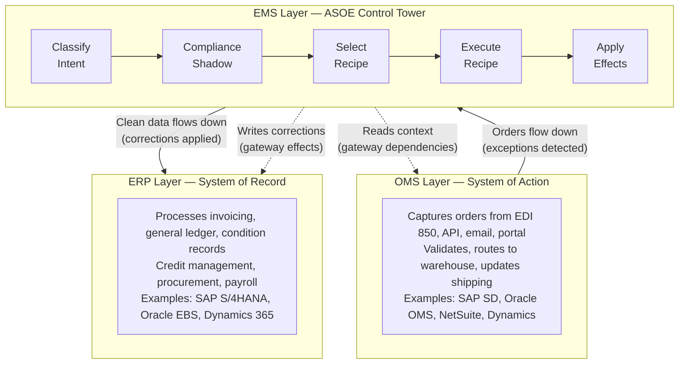
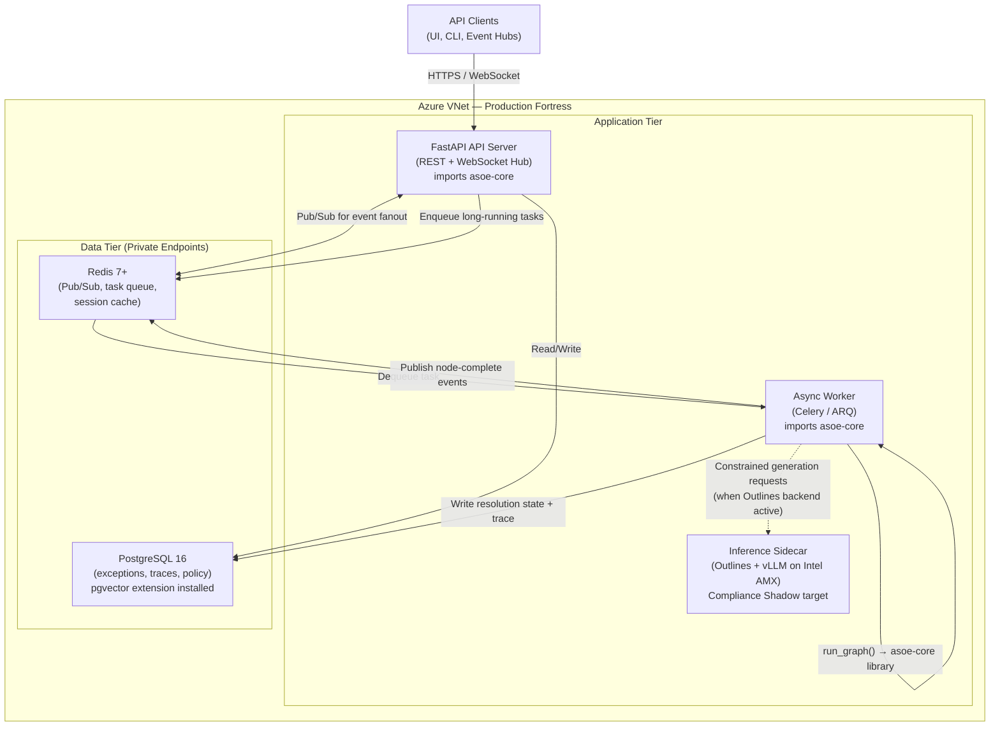
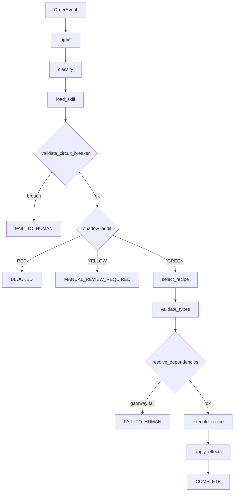
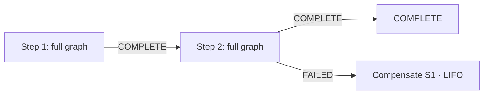
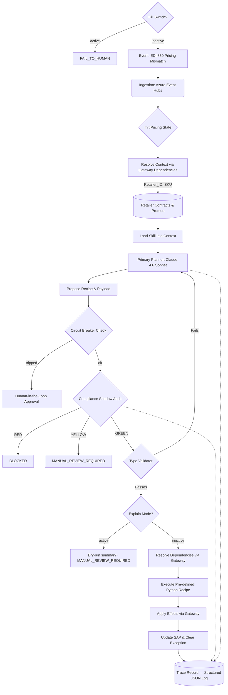
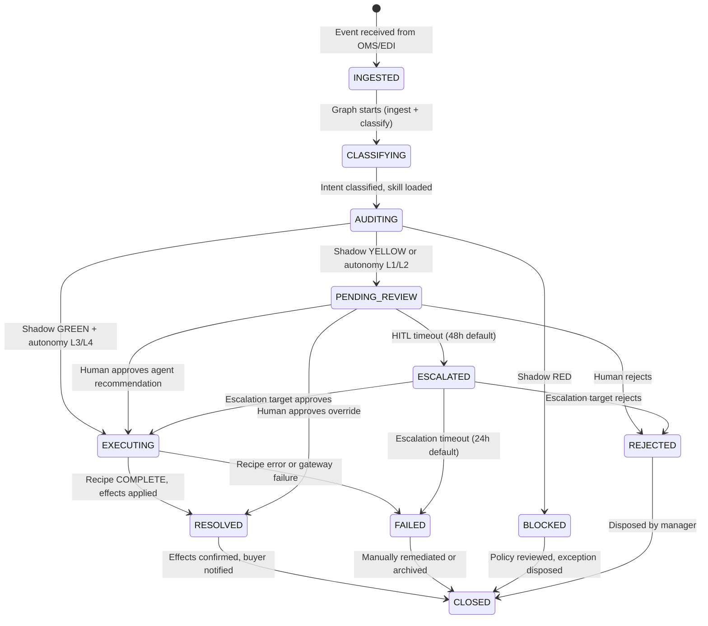
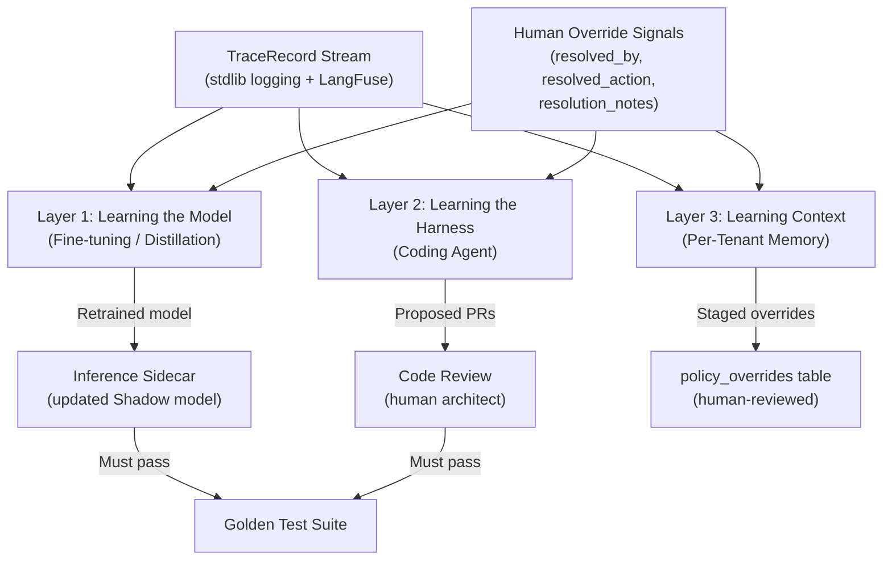

# Architecture Spec: CPG Agentic AI Exception Management System (V3 — Unified Core Specification)

**Document Owner:** Principal AI Systems Architect
**Domain:** Consumer Packaged Goods (CPG) Supply Chain (Order-to-Cash)
**Scope:** V1.0 is strictly constrained to **Pricing & Promotional Exceptions**.
**Design Reference:** [DESIGN.md](DESIGN.md) — maps these patterns to concrete modules, classes, and wiring.
**Lineage:** This document unifies `architecture_v2.md` (original core engine spec) with the V1-planned ASOE Core items from `consol_arch.md` (unified platform architecture in `asoe-ui`). All content from `architecture_v2.md` is preserved; `architecture_v2.md` is now superseded by this document. Sections marked *[NEW]* originate from `consol_arch.md`.

---

## 1. Abstract Solution Architecture

This system acts as an intelligent, event-driven orchestration layer sitting above legacy enterprise systems (SAP, Manhattan WMS). To ensure enterprise-grade reliability and compliance, it abandons the traditional "autonomous free-thinking agent" model in favor of a **"Modular Skill-Recipe Sandwich Architecture"**.

In this model, non-deterministic Large Language Model (LLM) reasoning is tightly constrained:
* **Top Guardrail:** Structured progressive disclosure (Skill definitions) and typed gateway dependencies for deterministic context loading.
* **Middle:** Cloud-based reasoning core (Claude 4.6 Sonnet).
* **Bottom Guardrail:** A localized, high-speed "Compliance Shadow" auditor and strictly typed, hardcoded Python execution "Recipes".

### Core Innovations:
1. **Pivot to Recipe from Rules:** Plain Rules (static, fragile, and often hallucinated by LLMs) to Recipes (deterministic, pre-validated, and modular) represents a shift toward "Expert-in-the-Loop" automation.
2. **The Skill-Recipe Decoupling:** Skills act as the Brain (orchestrating which tools to use), while Recipes act as the Muscle (the exact, unchangeable logic for a business process). The AI does not write code or guess API parameters. The **Brain** (Skill) maps user intent to a specific **Muscle** (a predefined Python Recipe).
   e.g. Skill: "When you see a price mismatch > 3%, explain it to the user and ask to apply the PriceAdjustment recipe."
   Recipe: A hard-coded Python script that calculates the delta, checks the SAP/ERP condition types, and executes the POST request.
3. **The Compliance Shadow:** A secondary AI layer dedicated exclusively to auditing the primary AI's proposed solutions against Retailer Penalty Matrices before execution.
4. **Event-Driven State Machine:** Predictable, cyclical LangGraph workflows prevent infinite agent loops and ensure 100% path predictability.

### Platform Principles

1. **Determinism Over Autonomy.** AI reasoning is constrained to classification and context loading. All execution flows through immutable, pre-validated Python recipes. The LLM never writes code, guesses thresholds, or invents business logic.

2. **Compliance Before Execution.** Every proposed action is audited by a Compliance Shadow before any recipe runs. Verdicts are constrained to GREEN (proceed), YELLOW (human review required), or RED (halt). There are no overrides and no bypasses.

3. **Decoupled Reasoning and Execution.** Skills guide reasoning (the "Brain"). Recipes execute deterministic logic (the "Muscle"). The orchestration layer routes between them. These three concerns never cross boundaries.

4. **Observability as a First-Class Product.** Every graph execution emits a structured TraceRecord. Every decision — intent, shadow verdict, recipe, gateway call, terminal status — is logged, correlated via trace_id, and auditable.

---

## 2. V1 Scope & Non-Functional Requirements *[NEW]*

### V1 Scope

| Dimension | V1 Boundary |
|---|---|
| **Exception types** | Pricing discrepancies, promotional corrections, credit blocks, duplicate purchase orders |
| **Intents** | `CONTRACTUAL_CORRECTION`, `CREDIT_BLOCK`, `MASS_PRICING_ERROR`, `DUPLICATE_PO` |
| **Recipes** | `PriceAdjustmentRecipe.py`, `CreditHoldReleaseRecipe.py`, `DuplicatePORecipe.py` |
| **Terminal statuses** | `COMPLETE`, `COMPLETE_WITH_CHILDREN`, `FAIL_TO_HUMAN`, `MANUAL_REVIEW_REQUIRED`, `BLOCKED`, `REJECTED` |
| **Pipeline** | 11-node LangGraph state machine |
| **Lifecycle** | 11-state exception lifecycle (INGESTED through CLOSED, including ESCALATED) |
| **Tests** | Full suite must pass (`python -m pytest`) |
| **RAG** | Deferred to V2 — all context is structured and resolved via typed gateways |
| **Continual learning** | V2 design blueprint included; not a V1 deliverable |

### Non-Functional Requirements

| Requirement | Target | Notes |
|---|---|---|
| **Concurrent API clients** | 500 | WebSocket + REST connections served by FastAPI |
| **Event publish latency** | 3–10 seconds | Per-node pipeline progress events published to Redis pub/sub |
| **Resolution SLA** | 8 min (p50), 12 min (p95), 15 min (p99) | End-to-end from event ingestion to effects applied. HITL wait time excluded from SLA measurement. |
| **Availability** | 99.9% | AKS multi-replica + topology spread |
| **Audit retention** | 7 years | TraceRecords + policy audit log (SOX requirement) |

---

## 3. System Context *[NEW]*

ASOE operates as an independent orchestration layer between two enterprise system tiers. It does not replace either — it bridges the gap where exceptions fall through.



### System Boundary

ASOE **owns:** exception classification, compliance audit, deterministic resolution, buyer notification, and the audit trail.

ASOE **does not own:** order lifecycle, inventory, shipping, invoicing, or general ledger. Those remain in OMS and ERP respectively.

### Exception Responsibility

| Exception Type | Where Managed | ASOE Role | Version |
|---|---|---|---|
| Operational (wrong SKU, out of stock) | OMS Layer | Not in scope | — |
| Financial (invoice mismatch, credit limit) | ERP Layer / EMS | **ASOE orchestrates** classification, audit, and resolution via gateway effects to ERP | V1 |
| Cross-system (duplicate PO, price mismatch between OMS and ERP) | **EMS Layer (ASOE)** | **ASOE orchestrates** cross-system correlation and resolution via gateway effects to OMS + ERP | V1 |
| Trade/promotional (deductions, chargebacks, off-invoice claims) | TPM + EMS | **ASOE orchestrates** resolution; TPM validates promotion terms via gateway | V2 |
| Physical supply chain (short-ship, broken pallet, damage claim) | WMS/TMS + EMS | **ASOE orchestrates** classification and routing; claims lifecycle managed by WMS/TMS via gateway | V3 |
| Retailer compliance (OTIF penalties, routing guide violations) | Retailer Portal + EMS | **ASOE orchestrates** dispute workflows against retailer-specific compliance programs via gateway | V3 |

> **Language note:** ASOE always "orchestrates" — in every version. The pattern is identical: classify → audit → select recipe → execute via gateway → apply effects. V1 gateway adapters are stubbed, V2/V3 adapters connect to real external systems. The architecture does not change; only the vocabulary (intents, recipes, adapters) expands.

### Human Actors

| Role | Description | API Permissions |
|---|---|---|
| `analyst` | Order Management Analyst | Read exceptions, approve/override individual exceptions |
| `manager` | Trade/Pricing Manager | All analyst permissions + bulk actions, rule config, escalation targets |
| `admin` | System Administrator | All permissions + user management, SSO config, policy writes, audit log access |
| `viewer` | Read-Only Stakeholder | Read exceptions and dashboard metrics only |
| `partner` | External Partner | Read exceptions scoped to own orders only (RLS-enforced) |

### External System Integration

| System | Protocol | Direction | Adapter Status |
|---|---|---|---|
| SAP S/4HANA | RFC/BAPI via gateway adapter | Read (pricing, credit) + Write (condition records, hold release) | Stubbed (V1) |
| OMS (generic) | REST API via gateway adapter | Read (fulfillment status, PO details) | Stubbed (V1) |
| EDI Gateway | Azure Event Hubs (EDI 850 → JSON) | Inbound events | Stubbed (V1) |
| Buyer Portal | Notification gateway effect | Outbound notifications | Stubbed (V1) |
| LangFuse | HTTP SDK (optional) | Trace forwarding | Live (V1) |
| TPM System (SAP TPM, Vistex) | REST / RFC via gateway adapter | Read (promotion terms, proof-of-performance) | V2 |
| EDI 810/820/824/856/860/861 | Azure Event Hubs (multi-document) | Inbound events + correlation | V2 |
| WMS / TMS | REST API via gateway adapter | Read (shipment status, inspection data, carrier claims) | V3 |
| Retailer Portals (Retail Link, Vendor Central) | REST API / scraping adapter | Read (chargebacks, compliance penalties, dispute status) | V3 |

---

## 4. System Architecture & Technical Stack

The application is deployed as a suite of containerized microservices on Microsoft Azure. ASOE Core is a **Python library**, not a standalone service — both the FastAPI API server and the async worker import it directly. The inference sidecar is a separate optional container that serves constrained-generation models. Image builds use fast, deterministic Python dependency resolution on Ubuntu 24.04 base images.

> **Scaling evolution path:** The library model is a deliberate V1 choice — see [ADR-001: Core Deployment Model](docs/adr/ADR-001-core-deployment-model.md) for the full rationale, alternatives considered (in-process library vs. versioned package vs. standalone service), and staged evolution triggers. In summary: the library model does not block horizontal scaling (multiple worker pods import `asoe-core` independently), the extraction seam already exists (`run_graph()` typed interface + hexagonal gateway layer), and premature service extraction would add operational complexity with no proportional benefit at V1 scale. The migration path from library → versioned package → gRPC service requires zero changes to recipes, gateways, or the compliance shadow.

### 4.1 Infrastructure & Deployment Stack

| Component | Technology | Rationale / Description |
| :--- | :--- | :--- |
| **Cloud Provider** | Azure Kubernetes Service (AKS) | Hosts the LangGraph runner, MCP servers, API server, and workers in isolated, scalable pods. |
| **Inference Hardware** | Intel Xeon Sapphire Rapids | Dedicated AKS node pools using Advanced Matrix Extensions (AMX) for low-latency, localized shadow inferencing. |
| **Event Ingestion** | Azure Event Hubs | Captures high-throughput exception events (e.g., EDI 850) from SAP gateways. |
| **API Gateway** | Azure API Management (APIM) | Enforces the "Circuit Breaker" pattern, rate-limiting, and payload buffering. |
| **Security** | Azure Workload Identity | Pods authenticate via temporary tokens; no hardcoded API keys in environment variables. |

### 4.2 Application & AI Stack

| Layer | Technology | Rationale / Description |
| :--- | :--- | :--- |
| **Reasoning Core** | Claude 4.6 Sonnet | Azure AI Foundry deployment. Acts as the primary planner and intent router. |
| **Orchestration** | LangGraph (Python) | Manages state transitions and cyclical workflows for the exception lifecycle. |
| **Logic Layer** | Skill definition framework | Progressive disclosure files that load domain-specific rules only when needed. |
| **Policy** | Centralized policy module | Single source of truth for all business thresholds (discounts, circuit breaker limits, roles). |
| **Constrained Generation** | Three-tier backend chain | Custom backend → Outlines → Deterministic fallback. Ensures machine-consumed outputs (intents, verdicts, recipe selection) are schema-constrained at generation time. |
| **Infrastructure Gateways** | Hexagonal Architecture | Protocol-based gateway layer with timeout-enforced executor. Recipes declare dependencies/effects; orchestration mediates. Stub adapter for testing. |
| **Workflow Runner** | Saga pattern | Multi-step workflow execution. Each step runs the full graph. LIFO compensation on failure. |
| **Hardening** | Env-var switches | Kill switch halts all execution. Explain mode runs full pipeline read-only, returns dry-run summary. Both activate at call time, no restart needed. |
| **Context Resolution** | Gateway Dependencies | Structured data (retailer contracts, SKU pricing, credit profiles) is resolved via typed `GatewayDependency` declarations on recipe specs — deterministic, not probabilistic. RAG is deferred to V2 (see §7C). |
| **Compliance Shadow** | Llama 3.1 8B + vLLM | Target: localized model on AKS/Intel AMX for zero-latency penalty auditing. Currently uses deterministic fallback. |
| **Guardrails** | Pydantic + Outlines | Forces strict type-checking on execution payloads before triggering Recipes. |
| **Integration Protocol** | Model Context Protocol (MCP) | Target: wraps SAP/ERP endpoints into self-describing tool servers. Currently stubbed. The hexagonal gateway layer (§5.5) serves as the primary integration pattern for V1. |
| **Observability** | Structured JSON logging | Trace records (Pydantic, LangFuse-aligned) emitted via stdlib logging. Captures intent, shadow verdict, recipe, gateway calls, and terminal status per execution. |
| **Secret Management** | Azure Key Vault CSI | Secrets mounted to pods via Workload Identity. No hardcoded credentials. |

### 4.3 Platform Architecture Overview *[NEW]*



### Consolidated Core View

```
┌─────────────────────────────────────────────────────────────────────┐
│                     ASOE CORE (asoe2 repo)                          │
│                                                                     │
│  API Clients ──►  ┌───────────────┐    ┌───────────────────────┐   │
│  (UI, CLI,        │   FASTAPI     │    │    POSTGRESQL 16      │   │
│   Event Hubs)     │  (REST + WS   │──►│  (State, Audit,       │   │
│                    │   + RBAC)     │    │   Lifecycle, RLS,     │   │
│                    └───────┬───────┘    │   Checkpoints)        │   │
│                            │            └───────────────────────┘   │
│                    ┌───────▼───────┐              ▲                 │
│                    │   REDIS 7+    │              │                 │
│                    │  (Pub/Sub +   │──────────────┘                 │
│                    │   Task Queue  │                                │
│                    │   + Cache)    │                                │
│                    └───────┬───────┘                                │
│                            │                                       │
│                    ┌───────▼─────────────────────────────────┐      │
│                    │  ASYNC WORKER                           │      │
│                    │  ┌───────────────────────────────────┐  │      │
│                    │  │  ASOE CORE (run_graph)            │  │      │
│                    │  │  ┌───────┐ ┌────────┐ ┌────────┐ │  │      │
│                    │  │  │ Skill │→│ Shadow │→│ Recipe │ │  │      │
│                    │  │  └───────┘ └────────┘ └────────┘ │  │      │
│                    │  │  Gateway Layer (OMS / ERP)        │  │      │
│                    │  └───────────────────────────────────┘  │      │
│                    │            ↕ (optional)                 │      │
│                    │  ┌───────────────────────────────────┐  │      │
│                    │  │  INFERENCE SIDECAR                │  │      │
│                    │  │  Outlines + vLLM on Intel AMX     │  │      │
│                    │  │  (Compliance Shadow target)       │  │      │
│                    │  └───────────────────────────────────┘  │      │
│                    └─────────────────────────────────────────┘      │
│                                                                     │
│  ┌───────────────────────────────────────────────────────────────┐  │
│  │  CONTINUAL LEARNING LOOP (offline, V2 scope)                  │  │
│  │  TraceRecords + Override signals → Analysis → Propose         │  │
│  │  updates to: policy.py | SKILL.md | Shadow thresholds         │  │
│  │  Human architect reviews → Approved changes deployed          │  │
│  └───────────────────────────────────────────────────────────────┘  │
│                                                                     │
│  ┌───────────────────────────────────────────────────────────────┐  │
│  │  OBSERVABILITY (stdlib logging + LangFuse)                    │  │
│  │  Correlated traces: API → Worker → Core → Gateway             │  │
│  │  TraceRecord per run_graph() · trace_id end-to-end            │  │
│  └───────────────────────────────────────────────────────────────┘  │
└─────────────────────────────────────────────────────────────────────┘
```

### Key Clarifications

**ASOE Core is not an "AI Inference Engine."** It is a deterministic state machine that:
- Classifies intent via a **3-tier constrained backend chain** (Custom → Outlines → Deterministic Fallback)
- Audits via a Compliance Shadow (currently deterministic; target: Llama 3.1 8B on Intel AMX CPU)
- Executes immutable Python recipes
- Mediates all infrastructure I/O through a hexagonal gateway layer

In V1.0, the `DeterministicFallbackBackend` handles all decision points without any LLM call. The inference sidecar becomes relevant when:
- The Compliance Shadow needs a real model (Llama 3.1 8B for penalty matrix auditing)
- The Outlines constrained-generation backend is activated for production use
- Human-facing explanations need nuanced language (Claude Sonnet via Azure AI Foundry)

### 4.4 Component Topology *[NEW]*

#### Development (Docker Compose)

| Container | Source | Contents | Always On? |
|---|---|---|---|
| `asoe-core` | `asoe2/Dockerfile.core` | FastAPI dev server + asoe-core library (LangGraph, recipes, Compliance Shadow) | Yes |
| `asoe-ui-sandbox` | `asoe2/Dockerfile.ui` | Streamlit sandbox UI (for core-only development) | Yes |
| `asoe-inference` | `asoe2/Dockerfile.inference` | Outlines + torch + transformers (local LLM) | Optional (`--profile inference`) |
| `postgres` | Official image | PostgreSQL 16 + pgvector | Yes |
| `redis` | Official image | Redis 7+ | Yes |

All images use non-root user (`asoe`, UID 1000) and `uv` for deterministic Python dependency resolution.

> **Frontend:** The Next.js UI (`asoe-ui` repo) runs as a separate dev server outside this Docker Compose stack. See `asoe-ui` documentation for frontend topology.

#### Production (Azure Kubernetes Service)

| Deployment | Replicas | Node Pool | Source | Key Config |
|---|---|---|---|---|
| `asoe-api` | 2 | Standard | `asoe2/` + FastAPI layer | Topology spread, Workload Identity |
| `asoe-worker` | 2 | Standard | `asoe2/` + Celery/ARQ layer | Event Hubs consumer, graph executor |
| `asoe-inference` | 1 | Intel AMX (Xeon Sapphire Rapids) | `asoe2/Dockerfile.inference` | 20Gi memory, AMX nodeSelector |

**Infrastructure services:** Azure Front Door (CDN + WAF), Azure Database for PostgreSQL (Flexible Server, Private Endpoint), Azure Cache for Redis (Private Endpoint), Azure Key Vault (CSI driver for secrets), Azure Event Hubs (EDI 850 ingestion).

**Security posture:** Azure Managed Identities for passwordless auth between containers and data services. Private Endpoints for PostgreSQL and Redis — no public network access. Secrets mounted via Key Vault CSI driver (`k8s/core/secret-provider.yaml`). No credentials in source code, Dockerfiles, or environment variable defaults.

### 4.5 Runtime Domains (asoe2 scope) *[NEW]*

| Domain | Technology | Responsibility |
|---|---|---|
| **API Server** | FastAPI (async, Uvicorn) | REST endpoints, WebSocket hub, synchronous graph invocations, auth |
| **Async Worker** | Celery / ARQ + asoe-core | Long-running graph executions (8-min SLA), Event Hubs consumer. **Back-pressure:** max concurrency per worker is capped at 4 concurrent `run_graph()` tasks via Celery `worker_concurrency` / ARQ `max_jobs`. When queue depth exceeds 100 pending tasks, new `POST /resolve/async` requests receive HTTP 429 with `Retry-After` header. Queue depth is exposed via `asoe_task_queue_depth` Prometheus metric. |
| **Inference Sidecar** | Outlines + vLLM on Intel Xeon AMX | Constrained generation, Compliance Shadow model serving |
| **Data Tier** | PostgreSQL 16 + Redis 7+ | Exception state, audit trail, policy config, real-time pub/sub |

---

## 5. ASOE Core: The Skill-Shadow-Recipe Engine

The core engine resolves the central tension — AI flexibility vs. enterprise determinism — via the **Skill-Shadow-Recipe** pattern:

- **Top Guardrail:** Structured progressive disclosure (Skill definitions) and typed gateway dependencies for deterministic context loading.
- **Middle:** Cloud-based reasoning core (Claude Sonnet) or deterministic fallback.
- **Bottom Guardrail:** A localized Compliance Shadow auditor and strictly typed, immutable Python execution Recipes.

### 5.1 The 11-Node LangGraph Pipeline *[NEW]*



Each node function has the signature `def node_name(state: GraphState) -> GraphState` and returns a partial state update. Source: `orchestration/nodes.py`.

| # | Node | Responsibility | Failure Behavior |
|---|---|---|---|
| 1 | `ingest` | Validates `OrderEvent` required fields, computes `batch_total_variance`, increments `update_count` | `FAIL_TO_HUMAN` on missing `order_id`, `po_price`, or `sap_base_price` |
| 2 | `classify` | Computes `PricingDiscrepancy`, calls `backend.classify_intent()` → constrained to `AllowedIntent` enum | Routes to `FAIL_TO_HUMAN` on UNKNOWN intent |
| 3 | `load_skill` | Loads `skills/*.md` verbatim via `SkillLoader.select_for_event()` — no summarization. **Context window budget:** V1 skill documents are capped at 4,000 tokens each. As the skill library grows beyond ~10 skills, a V1.5 upgrade will introduce skill selection by intent-to-skill mapping (deterministic index lookup) rather than loading all matching skills, preventing context window saturation before RAG is available in V2. | Continues with no skill if none matches |
| 4 | `validate_circuit_breaker` | Checks `update_count` vs `CIRCUIT_BREAKER_MAX_UPDATES` (50) and `batch_total_variance` vs `CIRCUIT_BREAKER_MAX_VARIANCE` ($10,000) | `FAIL_TO_HUMAN` on breach |
| 5 | `shadow_audit` | Creates `ComplianceShadow`, calls `audit()` → `ComplianceDecision`, then `enforce()` → `ShadowEnforcement` | GREEN → continue, YELLOW → `MANUAL_REVIEW_REQUIRED`, RED → `BLOCKED` |
| 6 | `select_recipe` | Calls `backend.propose_recipe()` → constrained to `AllowedRecipeName` | `FAIL_TO_HUMAN` if no recipe available |
| 7 | `validate_types` | Builds `RecipeInvocation` with typed params; injects policy thresholds from `contracts/policy.py` | `FAIL_TO_HUMAN` on missing required params |
| 8 | `resolve_dependencies` | Reads `RecipeSpec.dependencies`, calls gateways via `GatewayExecutor`, stores results in `resolved_data` | `FAIL_TO_HUMAN` on gateway failure |
| 9 | `execute_recipe` | Calls `RecipeExecutor.run()`, routes by autonomy level (L1/L2 → `MANUAL_REVIEW_REQUIRED`, L3/L4 → auto-execute) | `FAIL_TO_HUMAN` on recipe error |
| 10 | `apply_effects` | Reads `RecipeSpec.effects`, calls gateways for ERP writes and buyer notifications | Logs failure but does NOT undo recipe result |
| 11 | END | Terminal state; `TraceRecord` emitted to stdlib logging + optional LangFuse forwarding | — |

**Explain Mode** (`ASOE_EXPLAIN_MODE=1`): Replaces `execute_recipe` with `explain_only` node. Both `resolve_dependencies` and `apply_effects` are skipped entirely. The full reasoning pipeline runs (classify → shadow → select recipe → validate types) but no recipe executes and no side effects fire. Returns `MANUAL_REVIEW_REQUIRED` with a dry-run summary.

**Kill Switch** (`ASOE_KILL_SWITCH=1`): Checked in `run_graph()` **before any node runs**. Zero nodes execute. Returns `FAIL_TO_HUMAN` immediately. TraceRecord is still emitted.

### 5.2 GraphState Schema *[NEW]*

The complete typed state envelope passed through the pipeline. Source: `contracts/models.py`, `GraphState` class with `extra="forbid"` (no untyped fields allowed).

| Field | Type | Default | Populated By |
|---|---|---|---|
| `event` | `OrderEvent` | required | Caller |
| `discrepancy` | `Optional[PricingDiscrepancy]` | `None` | `classify` |
| `rag_context` | `RagContext` | factory | Reserved for V2 |
| `skill` | `Optional[SkillDocument]` | `None` | `load_skill` |
| `intent` | `Intent` | `Intent.UNKNOWN` | `classify` |
| `confidence` | `float` | `0.0` | `classify` |
| `shadow` | `Optional[ComplianceDecision]` | `None` | `shadow_audit` |
| `selected_recipe` | `Optional[str]` | `None` | `select_recipe` |
| `invocation` | `Optional[RecipeInvocation]` | `None` | `validate_types` |
| `execution_log` | `Optional[ExecutionLog]` | `None` | `execute_recipe` |
| `final_status` | `Optional[TerminalStatus]` | `None` | Any node (on halt/completion) |
| `explanation` | `Optional[str]` | `None` | Auto-populated at terminal state |
| `update_count` | `int` | `0` | `ingest` |
| `batch_total_variance` | `float` | `0.0` | `ingest` |
| `resolved_data` | `Dict[str, Any]` | `{}` | `resolve_dependencies` |
| `effect_results` | `List[GatewayResponse]` | `[]` | `apply_effects` |

#### 5.2.1 OrderEvent Schema (Inbound Contract)

Every API consumer (FastAPI endpoint, Event Hubs consumer, sandbox CLI) constructs an `OrderEvent` to feed into the pipeline. Source: `contracts/models.py`.

> **V2 evolution:** `OrderEvent` is a V1-specific specialization. V2 introduces a discriminated union `ExceptionEvent = OrderEvent | ShipmentEvent | PaymentEvent | ReceivingEvent`, where each variant carries domain-specific required fields (e.g., `ShipmentEvent` requires `shipment_id`, `carrier_id`, `damage_type` instead of `po_price`, `sap_base_price`). The `event_type` field serves as the discriminator. The `ingest` node dispatches validation per variant. Existing V1 callers are unaffected because `OrderEvent` remains a valid variant. See Section 16 for the full roadmap.

| Field | Type | Default | Description |
|---|---|---|---|
| `order_id` | `str` | required | PO / order identifier |
| `line_item` | `int` | `1` | Line item number within the order |
| `sku` | `Optional[str]` | `None` | Product SKU |
| `event_type` | `str` | `"EDI_850_PRICE_MISMATCH"` | Event classification (drives skill selection) |
| `po_price` | `float` | required | Purchase order price from buyer |
| `sap_base_price` | `float` | required | SAP/ERP base price (system of record) |
| `retailer_id` | `Optional[str]` | `None` | Customer / retailer identifier |
| `event_ts` | `Optional[str]` | `None` | Event timestamp (ISO 8601) |
| `requester_role` | `Optional[str]` | `None` | Role of the requester (used by credit hold checks) |
| `credit_limit` | `Optional[float]` | `None` | Customer credit limit (for CREDIT_BLOCK intent) |
| `current_exposure` | `Optional[float]` | `None` | Current credit exposure (for CREDIT_BLOCK intent) |
| `line_count` | `int` | `1` | Number of line items in the batch (mass-update detection) |
| `metadata` | `Dict[str, Any]` | `{}` | Extended data (e.g., `signal_scores` for DUPLICATE_PO, `matched_po_id`) |

#### 5.2.2 ExecutionLog Schema (Audit Trail)

Attached to `GraphState.execution_log` after recipe execution. Contains the full audit trail including human override fields. Source: `contracts/models.py`.

| Field | Type | Default | Description |
|---|---|---|---|
| `trace_id` | `str` | required | UUID propagated from `ComplianceDecision` |
| `recipe_name` | `Optional[str]` | `None` | Recipe that was executed |
| `inputs` | `Dict[str, Any]` | `{}` | Parameters passed to the recipe |
| `outputs` | `Dict[str, Any]` | `{}` | Recipe output (includes `recommended_action`, `autonomy_level`, `notification_template` for DUPLICATE_PO) |
| `errors` | `List[str]` | `[]` | Execution errors (non-empty → `FAIL_TO_HUMAN`) |
| `constrained_outputs` | `Dict[str, str]` | `{}` | Map of field → schema name (e.g., `"intent" → "IntentDecision"`) |
| `intent_selected` | `Optional[str]` | `None` | Intent enum value selected |
| `rag_chunks` | `List[str]` | `[]` | Retrieved skill document chunks |
| `shadow_policy_hits` | `List[str]` | `[]` | Policy identifiers matched by Compliance Shadow |
| `skill_name` | `Optional[str]` | `None` | Loaded skill document name |
| `shadow_verdict` | `Optional[str]` | `None` | Shadow status: `GREEN`, `YELLOW`, or `RED` |
| `resolved_by` | `Optional[str]` | `None` | Username of human who overrode the agent (SOX audit field) |
| `resolved_action` | `Optional[str]` | `None` | Actual action taken by human (may differ from agent recommendation) |
| `resolution_notes` | `Optional[str]` | `None` | Free-text notes from human override |

### 5.3 Constrained Generation

All LLM-generated values consumed by code are **constrained at generation time** via Pydantic Literal types. Free-form text is allowed only for human-facing explanations.

**Per-task Provider Router** (`constraints/router.py`):

V1 PR-1 generalised the constraint backend to a per-task,
provider-agnostic router so every trio call (`classify_intent` /
`propose_recipe` / `shadow_decision`) can be served by a different
provider — or the deterministic fallback — without code changes.
Resolution order:

```
0. ASOE_KILL_SWITCH=1     → DeterministicFallbackBackend (no TCP)
0. ASOE_EXPLAIN_MODE=1    → DeterministicFallbackBackend (no paid LLM)
1. task ∈ ASOE_LLM_DISABLE_FOR → DeterministicFallbackBackend
2. ASOE_LLM_PROVIDER_<TASK>    (per-task override)
3. ASOE_LLM_PROVIDER           (global default)
4. USE_OUTLINES_BACKEND=1      (legacy short-circuit → outlines)
5. fallback                    (DeterministicFallbackBackend)
```

**Provider matrix** (V1 PR-1 implementations):

| Provider | Hosting | Status |
|---|---|---|
| `anthropic` | Anthropic API direct OR Azure AI Foundry private endpoint | Full |
| `openai` | OpenAI direct, Azure OpenAI, or OpenAI-compatible (vLLM, TGI, LiteLLM, LocalAI) — including self-hosted Qwen on a vLLM cluster | Full |
| `ollama` | Self-hosted (Qwen2.5+, Llama 3.1+, Mistral) or Cloud (private peering only in production) | Full |
| `huggingface` | HF Dedicated Inference Endpoints (production) or Serverless Inference API (sandbox-only) | Full |
| `google` | Vertex AI / Gemini | Stub (V1.x) |
| `outlines` | Local in-process Outlines + transformers | Pre-existing |
| `local` | Sandbox SLM via `LOCAL_LLM_BACKEND_CLASS` | Pre-existing |
| `fallback` | Deterministic rule engine — always available | Default |

The provider abstraction lives at `llm/provider_protocol.py`
(`LLMProviderClient` Protocol). Each provider implements one method
— `call_with_tool()` — returning a `ToolCallResult` with normalised
fields (model_id, request_id, token usage including cache hits,
latency, stop reason). Adding a new provider is a single new file
under `llm/<name>_client.py` plus a registry entry in
`llm/provider_factory.py` — no changes to constraints/, recipes/,
or orchestration/.

**Tool-use is the constrained-output mechanism.** Every provider
exposes OpenAI-style `tools` + forced `tool_choice`; the
`tool_input_schema` is derived from `IntentDecision.model_json_schema()`
etc. with sorted keys so the cacheable prefix is byte-stable across
pods.

**`RemoteLLMBackend`** (`constraints/llm_backend.py`) is the
provider-agnostic constraint backend that wraps any
`LLMProviderClient`. Per-call composition:

```
sanitiser (allowlist + length-cap) → circuit breaker (acquire) →
provider call → budget consume → Pydantic re-validate
```

On `ProviderError`, `CircuitOpen`, budget hard-block, Pydantic
validation error, or any unexpected exception →
`RemoteLLMBackend` delegates to the deterministic backend for that
single trio call. The graph never sees a remote-LLM failure —
explicit failure as success state per CLAUDE.md §5.

**Cross-check on intent**: when an LLM-backed classifier is
active, the orchestration `classify` node runs the deterministic
classifier in parallel. Disagreement → `MANUAL_REVIEW_REQUIRED`
with reason `LLM_DETERMINISTIC_DISAGREEMENT`. Conservative
shakeout posture during V1 burn-in.

**Cost guardrails**: `ASOE_LLM_DAILY_USD_BUDGET` (default $5
sandbox) is a Redis-backed atomic counter. Hard-block at 100%,
soft-warn at 80%. The LLM-tier circuit breaker (separate from
the $10k batch breaker) trips at error_rate > 25% over 60s OR
p95_latency > 15s, with a 5-minute cooldown.

**Cache strategy**: the cacheable system prompt is the verbatim
`skills/*.md` catalog plus a per-task directive — both marked
cacheable. Per-call volatile content lives in the user message
AFTER the cached prefix. Anthropic uses
`cache_control: ephemeral`; OpenAI auto-caches at >1024 tokens;
Ollama and HF do not expose client-controlled caching.

If `OutlinesConstrainedBackend` fails to initialize (missing
`outlines` package), the router degrades gracefully to
`DeterministicFallbackBackend` with a `logger.warning()`.

**Fallback observability:** Every backend invocation records which tier actually served the request. The `ExecutionLog.constrained_outputs` map includes the backend tier used (e.g., `"intent" → "IntentDecision:DeterministicFallbackBackend"`). Fallback activations are surfaced as:
- A `backend_fallback` field in the `TraceRecord` (value: `"custom"`, `"outlines"`, or `"deterministic_fallback"`)
- A `logger.warning()` on every degradation event, including the reason (e.g., `"OutlinesConstrainedBackend: model load failed, falling back to DeterministicFallbackBackend"`)
- A Prometheus counter `asoe_backend_fallback_total{tier="deterministic_fallback"}` for alerting on sustained degradation
- **V2 training data flag:** TraceRecords where `backend_fallback == "deterministic_fallback"` are flagged with `is_fallback_generated: true` and **excluded from Layer 1 fine-tuning datasets** (see Section 12) to prevent hardcoded logic from contaminating the learned model

| Constrained Output | Schema | Allowed Values |
|---|---|---|
| Intent classification | `IntentDecision` → `AllowedIntent` | `CONTRACTUAL_CORRECTION`, `CREDIT_BLOCK`, `MASS_PRICING_ERROR`, `DUPLICATE_PO` |
| Shadow verdict | `ShadowDecision` → `AllowedShadowStatus` | `GREEN`, `YELLOW`, `RED` |
| Recipe selection | `RecipeProposal` → `AllowedRecipeName` | `PriceAdjustmentRecipe.py`, `CreditHoldReleaseRecipe.py`, `DuplicatePORecipe.py` |
| Resolution action | `AllowedResolutionAction` | `BLOCK_AND_NOTIFY`, `MERGE`, `SUPERSEDE`, `ALLOW_BOTH`, `ESCALATE`, `REQUEST_BUYER_CONFIRMATION` |

### 5.4 Policy Externalization

All business thresholds live in `contracts/policy.py`. **Recipes never import from the policy module.** All thresholds are injected by the orchestration layer via `validate_types` → `RecipeInvocation.params`.

| Constant | Value | Consumed By |
|---|---|---|
| `MAX_DISCOUNT_ALLOWED` | `0.15` (15%) | `PriceAdjustmentRecipe` via `erp_context` |
| `PRICE_CONDITION_TYPE` | `"YK07"` (default; **per-tenant override required**) | `PriceAdjustmentRecipe` via `erp_context`. Condition types vary by SAP client configuration (e.g., `YK07`, `ZK07`, `PR00`). This value **must** be overridable per tenant from V1 via the `policy_overrides` table (`policy_key = "PRICE_CONDITION_TYPE"`). The `validate_types` node resolves the tenant-specific value before injecting into `erp_context`. |
| `CREDIT_AUTHORIZED_ROLES` | `("ORDER_MANAGER", "FINANCE_DIRECTOR")` | `CreditHoldReleaseRecipe` as param |
| `CREDIT_EXPOSURE_TOLERANCE` | `5_000.0` | `CreditHoldReleaseRecipe` as param |
| `DUPLICATE_PO_THRESHOLD_AUTO_BLOCK` | `0.90` | `DuplicatePORecipe` as param. See **Similarity Algorithm** below. |
| `DUPLICATE_PO_THRESHOLD_REVIEW_REQUIRED` | `0.70` | `DuplicatePORecipe` as param |
| `DUPLICATE_PO_THRESHOLD_SOFT_FLAG` | `0.50` | `DuplicatePORecipe` as param |
| `DUPLICATE_PO_AUTONOMY_LEVELS` | dict (action → L1–L4) | `DuplicatePORecipe` as param |
| `MASS_UPDATE_LINE_COUNT_THRESHOLD` | `10` | `constraints/fallback_backend.py` |
| `CIRCUIT_BREAKER_MAX_UPDATES` | `50` | `orchestration/utils.py` |
| `CIRCUIT_BREAKER_MAX_VARIANCE` | `10_000.0` | `orchestration/utils.py` |
| `DISCREPANCY_THRESHOLD` | `0.15` | `orchestration/utils.py` |

**Duplicate PO Similarity Algorithm:** The `signal_scores` composite score consumed by the `DUPLICATE_PO_THRESHOLD_*` thresholds is a weighted average of three deterministic signals, not a single string similarity metric:

| Signal | Weight | Method | Description |
|---|---|---|---|
| `po_number_similarity` | 0.40 | Normalized Levenshtein distance | Character-level similarity between the candidate PO number and the matched PO number |
| `line_item_overlap` | 0.35 | Jaccard index on `(SKU, quantity)` tuples | Measures how many line items are shared between the two POs |
| `temporal_proximity` | 0.25 | Exponential decay over hours since `matched_po.created_at` | POs submitted within minutes of each other score higher |

The composite score `= 0.40 × po_number_similarity + 0.35 × line_item_overlap + 0.25 × temporal_proximity`. All three signals are computed deterministically by the `DuplicatePORecipe` — no embedding or ML model is involved. The weights are V1 constants; the evolution path supports per-tenant weight overrides via `policy_overrides`.

**Evolution path:** module constants → env vars → K8s ConfigMap → per-customer policy service. Changes at any stage require modification only in the orchestration layer and policy source, never in recipes.

### 5.5 Hexagonal Gateway Layer

Recipes never call external systems directly. Infrastructure I/O is decoupled via the Ports & Adapters pattern.

| Component | File | Role |
|---|---|---|
| Protocol (Port) | `gateways/base.py` | `InfrastructureGateway` typed interface |
| Registry | `gateways/registry.py` | Maps gateway names → adapter instances |
| Executor | `gateways/executor.py` | Wraps calls with tracing + timeout enforcement via `concurrent.futures` |
| Stub (Test) | `gateways/stub.py` | Canned responses, call recording, no network |

**Typed contracts:** `GatewayRequest` (gateway_name, operation, params, trace_id, timeout_ms) and `GatewayResponse` (status: `SUCCESS` | `FAILED` | `TIMEOUT` | `UNAVAILABLE`, data, error, duration_ms).

Recipe specs declare **dependencies** (data needed pre-execution) and **effects** (writes to apply post-execution) as typed tuples. The orchestration layer resolves dependencies before recipe execution and applies effects after. All calls are logged with trace_id correlation. A stub adapter satisfies the same protocol, enabling full graph execution in tests without network access.

### 5.6 Workflow Runner (Saga Pattern)

When a business scenario requires chained operations (e.g., duplicate PO check followed by price adjustment), the workflow runner sequences steps:



Multi-step workflows are executed by `WorkflowRunner` (`workflows/runner.py`). Each step runs the **full graph independently** — its own shadow audit, its own recipe. On failure at step N, declared compensation recipes for steps 1..N-1 are invoked in **LIFO (reverse) order**.

| Result Status | Meaning |
|---|---|
| `COMPLETE` | All steps succeeded |
| `FAILED` | A step failed; no compensation recipes declared |
| `COMPENSATED` | A step failed; compensation recipes invoked for completed steps |
| `PARTIAL` | Reserved for future partial-completion modes |

### 5.7 Recipe Registry *[NEW]*

Each recipe declares its spec in `recipes/registry.py`. The orchestration layer uses these specs to validate params, resolve gateway dependencies, and apply effects.

#### PriceAdjustmentRecipe.py

| Property | Value |
|---|---|
| **Allowed intents** | `CONTRACTUAL_CORRECTION`, `MASS_PRICING_ERROR` |
| **Required params** | `order_id`, `line_item`, `po_price`, `sap_base_price`, `max_discount_allowed`, `price_condition_type` |
| **Dependencies** | _(none in V1 — pricing data arrives in OrderEvent)_ |
| **Effects** | _(none in V1 — SAP write-back stubbed)_ |
| **Injected policy** | `MAX_DISCOUNT_ALLOWED` (0.15), `PRICE_CONDITION_TYPE` ("YK07") via `erp_context` |

#### CreditHoldReleaseRecipe.py

| Property | Value |
|---|---|
| **Allowed intents** | `CREDIT_BLOCK` |
| **Required params** | `order_id`, `requester_role`, `credit_limit`, `current_exposure`, `authorized_roles`, `exposure_tolerance` |
| **Dependencies** | _(none in V1 — credit data arrives in OrderEvent)_ |
| **Effects** | _(none in V1 — hold release stubbed)_ |
| **Injected policy** | `CREDIT_AUTHORIZED_ROLES`, `CREDIT_EXPOSURE_TOLERANCE` |

#### DuplicatePORecipe.py

| Property | Value |
|---|---|
| **Allowed intents** | `DUPLICATE_PO` |
| **Required params** | `order_id`, `po_number`, `customer_id`, `signal_scores`, `threshold_auto_block`, `threshold_review_required`, `threshold_soft_flag`, `autonomy_levels` |
| **Dependencies** | `get_fulfillment_status` (OMS gateway), `get_matched_po_details` (OMS gateway) |
| **Effects** | `buyer_notification` (notification gateway — see **Notification Channels** below) |
| **Injected policy** | `DUPLICATE_PO_THRESHOLD_AUTO_BLOCK` (0.90), `DUPLICATE_PO_THRESHOLD_REVIEW_REQUIRED` (0.70), `DUPLICATE_PO_THRESHOLD_SOFT_FLAG` (0.50), `DUPLICATE_PO_AUTONOMY_LEVELS` |
| **Resolution actions** | `BLOCK_AND_NOTIFY`, `MERGE`, `SUPERSEDE`, `ALLOW_BOTH`, `ESCALATE`, `REQUEST_BUYER_CONFIRMATION` |
| **Notification templates** | `duplicate_po_blocked`, `duplicate_po_inquiry`, `duplicate_po_amended` |

**Buyer Notification Channels:** The `buyer_notification` effect is dispatched through a pluggable notification gateway (`gateways/notification.py`) that supports multiple delivery channels per buyer, configured at the tenant level via `policy_overrides`:

| Channel | Protocol | When Used | V1 Status |
|---|---|---|---|
| Email | SMTP / SendGrid API | Default fallback for all buyers | Stubbed (V1) |
| EDI 824 (Application Advice) | AS2 / Azure Event Hubs | Large retailers (Walmart, Kroger, etc.) requiring EDI acknowledgments | Stubbed (V1) |
| Buyer Portal | REST API webhook to partner portal | Partners with API-enabled portals | Stubbed (V1) |
| In-App | WebSocket event to `partner`-role users | Partners with active WebSocket connections | Live (V1) |

The notification gateway resolves the preferred channel(s) per `retailer_id` from the `policy_overrides` table (`policy_key = "NOTIFICATION_CHANNELS"`). If no preference is configured, the system defaults to email. Multiple channels can be configured simultaneously (e.g., EDI 824 + email). Notification delivery status is recorded in `effect_results` on the `GraphState`.

### 5.8 Autonomy Levels *[NEW]*

Autonomy levels govern whether the `execute_recipe` node auto-executes or routes to `MANUAL_REVIEW_REQUIRED` for human approval. They are defined per resolution action in `DUPLICATE_PO_AUTONOMY_LEVELS` (`contracts/policy.py`).

| Level | Label | Agent Behavior | Routing in `execute_recipe` |
|---|---|---|---|
| **L1** | Observe | Agent flags the exception; takes no action | → `MANUAL_REVIEW_REQUIRED` |
| **L2** | Recommend | Agent recommends a resolution; human must approve to execute | → `MANUAL_REVIEW_REQUIRED` |
| **L3** | Act & Inform | Agent executes the resolution; notifies human post-action | → `COMPLETE` (auto-execute) |
| **L4** | Full Autonomy | Agent executes the resolution silently; logs for audit | → `COMPLETE` (auto-execute) |

**Default autonomy per resolution action:**

| Resolution Action | Default Autonomy | Rationale |
|---|---|---|
| `BLOCK_AND_NOTIFY` | L3 | Low risk — blocks a duplicate and notifies buyer |
| `ALLOW_BOTH` | L3 | Low risk — accepts both POs as distinct orders |
| `MERGE` | L2 | High risk — modifies line items; requires human approval |
| `SUPERSEDE` | L2 | High risk — replaces existing PO; requires human approval |
| `ESCALATE` | L1 | Always human-driven by definition |
| `REQUEST_BUYER_CONFIRMATION` | L2 | Outbound communication — human reviews before sending |

### 5.9 HITL Pause/Resume Protocol *[NEW]*

When the `shadow_audit` node returns a **YELLOW** verdict, the current codebase sets `final_status = MANUAL_REVIEW_REQUIRED` and terminates the graph. The target-state architecture upgrades this to a true pause/resume model using LangGraph's `interrupt()` mechanism:

**Pause (YELLOW path):**
1. `shadow_audit` calls `interrupt()` — the graph suspends before advancing to `select_recipe`.
2. The full `GraphState` is checkpointed to PostgreSQL via LangGraph's `PostgresSaver`, keyed by `trace_id`.
3. The exception transitions to the `PENDING_REVIEW` lifecycle state.
4. A `pipeline_progress` event with `status: "interrupted"` is published to the Redis pub/sub channel `asoe:ws:{tenant_id}`.

**Resume (approve):** `POST /api/v1/exceptions/{id}/approve` is the exclusive resume entry point:
1. Validates the caller's JWT holds `manager` or `admin` role.
2. Rehydrates the `GraphState` from the PostgreSQL checkpoint.
3. Calls `graph.invoke(None, config)` to resume execution from the interrupt point, advancing to `select_recipe`.
4. The exception transitions from `PENDING_REVIEW` → `EXECUTING`.

**Reject:** `POST /api/v1/exceptions/{id}/reject` transitions the exception to `REJECTED` with reason `HITL_REJECTED` without resuming the graph. The checkpoint is retained for audit.

**Timeout and escalation:** If no approval or rejection is received within the configured HITL window (default: 48 hours; configurable per tenant via `policy_overrides.hitl_timeout_hours`), the exception follows a **mandatory escalation path** rather than silently failing:
1. The background scheduler transitions the exception to `ESCALATED` (not `FAILED`) with reason `HITL_TIMEOUT`.
2. An escalation notification is sent to the configured escalation target(s) for the tenant (defined in `policy_overrides.escalation_targets` — a list of `manager`/`admin` user IDs or email addresses).
3. The escalation event is recorded in the `policy_audit_log` as an immutable SOX artifact with `policy_key = "HITL_ESCALATION"`, `changed_by = "SYSTEM"`, and the original `trace_id`.
4. If no action is taken within a second escalation window (default: 24 hours; configurable via `policy_overrides.escalation_timeout_hours`), the exception transitions to `FAILED` with reason `ESCALATION_TIMEOUT` and a compliance incident is logged.

The checkpoint is retained for audit at all stages. This two-tier timeout model ensures that no financial exception can silently expire without a mandatory human escalation chain — a SOX audit requirement.

**GREEN path:** On a GREEN verdict, `interrupt()` is not called; the graph advances directly to `select_recipe` with no checkpoint or human interaction required.

**Checkpoint size budget and retention:**
- **Size budget:** Serialized `GraphState` JSONB is estimated at 2–8 KB per checkpoint (dominated by `OrderEvent`, `SkillDocument`, and `ComplianceDecision`). The `resolved_data` dict from gateway responses may push individual checkpoints to ~50 KB in worst-case batch scenarios. A hard limit of 256 KB per serialized checkpoint is enforced; checkpoints exceeding this limit are logged as errors and the exception routes to `FAIL_TO_HUMAN`.
- **Retention policy:** Checkpoints for `RESUMED`, `REJECTED`, and `TIMEOUT` statuses are retained for 90 days in the active `checkpoints` table for audit queries. After 90 days, they are archived to the `checkpoints_archive` partitioned table (same schema, partitioned by `interrupted_at` month). The `trace_id` foreign key to `exceptions` ensures checkpoints are always traceable. Full deletion follows the 7-year audit retention policy (see Section 9.5).

> **Implementation note:** This is a target-state design. The current V1 codebase terminates the graph on YELLOW. The `interrupt()` + `PostgresSaver` upgrade is planned for V1.1 when the FastAPI layer is built. The lifecycle states and API endpoints in Sections 8 and 9 already account for this design.

---

## 6. Detailed Data Flow (The Exception Lifecycle)



### Multi-Step Workflow (Saga Pattern)

When a business scenario requires chained operations (e.g., duplicate PO check followed by price adjustment), the workflow runner sequences steps:


Each step runs the full graph independently (its own shadow audit, its own recipe). On failure at step N, declared compensation recipes for steps 1..N-1 are invoked in reverse order.

---

## 7. Key Design Decisions

### A. The "Skill-Recipe" Decoupling
We explicitly reject the paradigm of LLMs generating execution code dynamically.

**Skills** act as the cognitive playbook. They live in the prompt and teach the LLM how to categorize a discrepancy.

**Recipes** are pure, immutable Python functions. The LLM merely extracts parameters to feed into these functions, ensuring 100% deterministic interaction with the SAP condition technique.

### B. High-Performance Localized Compliance
The Compliance Shadow runs as a secondary auditor that evaluates every proposed recipe execution against retailer penalty matrices. The interface produces typed verdicts: GREEN (proceed), YELLOW (escalate), RED (halt). Target state: Llama 3.1 8B served via vLLM on AKS Intel Sapphire Rapids (AMX) nodes for sub-200ms latency, keeping penalty matrices within the Azure VPC.

### C. RAG Deferral (V2 Consideration)
V1.0 does not use RAG. All context required for recipe execution — retailer contracts, SKU pricing, credit profiles — is structured, keyed by known identifiers (retailer_id, SKU, order_id), and resolved deterministically via the gateway dependency layer (§5.5). Semantic vector search would introduce probabilistic retrieval into an otherwise deterministic pipeline, conflicting with Invariant #5 (no ad-hoc data enters the state machine).

RAG becomes justified in V2 if the system needs to:
- Search across **thousands of unstructured** retailer contract PDFs where the relevant clause isn't predictable from structured keys
- Support **free-text user queries** (e.g., "what's our promotional deal with Walmart on cereal?") where intent maps to document retrieval, not recipe execution
- Ingest **new document types** faster than gateway adapters can be written

Until then, the gateway layer provides the same data-fetching capability with typed contracts, timeout enforcement, and full trace correlation — without the non-determinism of similarity search.

### D. The Circuit Breaker & HITL Fallback
Deployed at the API Gateway level. If the automated state machine attempts to execute more than the configured maximum pricing updates in a time window, or if the total dollar variance of an execution batch exceeds the configured threshold, the Circuit Breaker trips. Execution halts, and the state transitions to a Human-in-the-Loop (HITL) approval state, preventing runaway systemic errors.

### E. Structured Observability (LangFuse-Aligned)
Every graph execution emits a trace record as structured JSON via stdlib logging. Fields are aligned to the LangFuse trace schema (trace_id, intent, shadow verdict, recipe, gateway calls, terminal status) so a future LangFuse handler can forward records with minimal adaptation. No LangFuse package dependency exists today — stdlib logging is the single emit point, keeping the system self-host friendly and auditable from day one.

### F. Externalized Policy & Recipe-Policy Decoupling
All business thresholds live in a single centralized policy module (`contracts/policy.py`). This includes discount caps, SAP condition types, authorized roles, credit exposure tolerance, duplicate PO classification thresholds, mass-update line-count thresholds, circuit breaker limits, and discrepancy thresholds.

**Recipes never import from the policy module.** All thresholds are injected by the orchestration layer — specifically, the `validate_types` node reads policy constants and passes them into recipe parameters via `RecipeInvocation.params`. This decoupling ensures:

1. **Immutable recipe logic.** The same recipe code serves different customer / vendor threshold sets without modification. A `PriceAdjustmentRecipe` with a 15% discount cap for Retailer A and a 20% cap for Retailer B uses identical code — only the injected `max_discount_allowed` value differs.
2. **Single point of threshold injection.** Auditors can verify which thresholds were active by inspecting `state.invocation.params` at one traceable location (`orchestration/nodes.py → validate_types`).
3. **Per-customer extensibility.** The evolution path — module constants → env vars → K8s ConfigMap → per-customer policy service — requires changes only in the orchestration layer and policy source, never in recipes.
4. **Fail-safe defaults.** If the orchestration layer fails to inject a threshold, `RecipeExecutor` required-params validation catches the `None` value and returns a structured error before the recipe runs.

This invariant is enforced by tests that verify recipe module source code contains no `contracts.policy` imports (see `TestRecipePolicyDecoupling`).

### G. Hexagonal Gateway Pattern
Recipes never call external systems directly. Instead, recipe specs declare dependencies (data needed pre-execution) and effects (writes to apply post-execution) as typed tuples. The orchestration layer resolves dependencies before recipe execution and applies effects after, both mediated by a gateway executor with per-call timeout enforcement. All calls are logged with trace_id correlation. A stub adapter satisfies the same protocol, enabling full graph execution in tests without network access.

### H. Operational Hardening
Two env-var switches provide coarse-grained production safety:
- **Kill switch**: halts all automation before any node runs. Returns FAIL_TO_HUMAN. No LLM calls, no recipes.
- **Explain mode**: runs the full reasoning pipeline (classify → shadow → select recipe → validate types) but stops before recipe execution. Returns a dry-run summary with MANUAL_REVIEW_REQUIRED. Shadow and circuit breaker protections remain active.

Both are evaluated at call time — no restart needed.

### I. LLM Tiering & Ensemble Strategy

V1.0 already implements a tiered inference strategy through its three-tier constrained generation backend chain and the separation of reasoning core from compliance shadow. This section documents the rationale and outlines when additional tiering or ensemble voting becomes justified.

#### Current Tiering (V1.0)

| Tier | Component | Model / Backend | Purpose | Cost |
|---|---|---|---|---|
| 0 (no LLM) | Deterministic fallback | Heuristic if/elif | Intent classification, recipe selection, shadow verdicts | Zero |
| 1 (small local) | Compliance Shadow | Llama 3.1 8B on Intel AMX (target) | Policy auditing against penalty matrices | Low (on-prem inference) |
| 2 (frontier cloud) | Reasoning Core | Claude 4.6 Sonnet via Azure AI Foundry | Primary planning, intent routing, parameter extraction | High (API calls) |

The backend chain (`Custom → Outlines → DeterministicFallbackBackend`) degrades gracefully: if the constrained LLM backend is unavailable or unnecessary, the deterministic fallback handles all V1.0 decision points without any LLM call.

#### Why Multi-LLM Voting Is Not Used in V1.0

Multi-model ensemble voting (running N models on the same input and taking majority vote) is a valid technique for open-ended generation tasks where hallucination detection is the goal. It does not apply here because:

1. **Output space is too small to benefit.** Intent classification (4 values), shadow verdicts (3 values), and recipe selection (3 values) are all constrained to small enums via Outlines. Voting reduces variance in high-entropy outputs; these are low-entropy by design.
2. **Correlated errors defeat voting.** Models trained on similar data exhibit correlated failure modes on the same edge cases. Three models agreeing on a wrong classification does not make it correct. Schema-constrained generation plus Pydantic validation is a stronger guarantee.
3. **The Shadow already provides a structural second opinion.** The Skill–Shadow architecture is superior to N-way voting because the two stages have *different objectives* (propose vs. audit), not the same objective repeated. This catches policy violations that homogeneous voters would consistently miss.
4. **Tiebreaker policy is itself business logic.** If voters disagree (e.g., two GREEN, one RED), the resolution rule encodes policy — which must live in recipes or the compliance module, not in an ad-hoc voting layer. The Shadow verdict already fills this role with clear semantics.
5. **Cost and latency.** Voting multiplies LLM calls by 2–3× per decision point. For a pipeline with 2–3 LLM calls per graph run, this means 6–9 calls with no proportional improvement in a constrained-output system.

#### When Voting Becomes Justified (V2+)

Ensemble voting should be reconsidered if:
- The system introduces **free-text generation** consumed by humans or downstream systems (e.g., explanation summaries, contract clause extraction via RAG)
- Intent space grows beyond **~15 intents** where boundary ambiguity makes single-model classification unreliable
- **Safety-critical outputs** (e.g., financial amounts, penalty calculations) are generated rather than looked up — voting can catch arithmetic hallucination

#### When Frontier Models Become Justified

V1.0's four intents, three recipes, and structured EDI inputs do not require frontier-model reasoning. The deterministic fallback handles all decision points. Claude 4.6 Sonnet earns its cost when:
- Inputs become **unstructured** (free-text emails, PDF contract clauses — V2 RAG scope per §7C)
- Intent space **scales beyond heuristic coverage** (~15+ intents with overlapping features)
- **Multi-step planning** is required beyond predefined `WorkflowDefinition` sequences
- **Human-facing explanations** need nuanced, context-aware language (explain mode in V1.0 is the first use case)

Until those conditions are met, the deterministic fallback and small local models provide equivalent accuracy at a fraction of the cost.

> **Additional ADRs:** Standalone ADR documents with full rationale, alternatives considered, expert perspectives, and review triggers are maintained in `docs/adr/`. These supplement the design decisions above with detailed records for decisions that warrant independent review (e.g., ADR-021: Core Deployment Model, ADR-022: Database Access Pattern).

---

## 8. API Contract *[NEW]*

The FastAPI server exposes REST endpoints for CRUD operations and a WebSocket endpoint for real-time pipeline updates. All endpoints are prefixed with `/api/v1/`.

### 8.1 Authentication

All endpoints except `/api/auth/*` and `/api/v1/health` require a valid JWT Bearer token. See Section 11.1 for the full authentication architecture.

### 8.2 REST Endpoints

| Method | Path | Auth | Description |
|---|---|---|---|
| `POST` | `/api/v1/exceptions/resolve` | analyst+ | Synchronous resolution — constructs `OrderEvent`, runs `run_graph()`, returns result |
| `POST` | `/api/v1/exceptions/resolve/async` | analyst+ | Async resolution — enqueues task, returns `{ task_id, status: "queued" }` |
| `POST` | `/api/v1/exceptions/resolve/explain` | analyst+ | Explain mode dry-run — runs full pipeline without recipe execution |
| `GET` | `/api/v1/exceptions` | analyst+ | Paginated exception queue (filter by: status, intent, tenant) |
| `GET` | `/api/v1/exceptions/{id}` | analyst+ | Exception detail including lifecycle state and GraphState |
| `PATCH` | `/api/v1/exceptions/{id}/override` | manager+ | Human override: `{ action, notes, resolved_by }` |
| `GET` | `/api/v1/exceptions/{id}/trace` | analyst+ | Full `TraceRecord` JSON for audit |
| `GET` | `/api/v1/exceptions/{id}/line-items` | analyst+ | Line-item detail for exception queue expansion and detail panel |
| `GET` | `/api/v1/exceptions/{id}/analysis` | analyst+ | Agent analysis with per-line diagnosis and pricing waterfall data |
| `POST` | `/api/v1/exceptions/{id}/approve` | manager+ | Resume paused HITL exception — rehydrates checkpoint, transitions PENDING_REVIEW → EXECUTING |
| `POST` | `/api/v1/exceptions/{id}/reject` | manager+ | Reject paused HITL exception — transitions to REJECTED with reason HITL_REJECTED |
| `POST` | `/api/v1/workflows` | manager+ | Multi-step workflow: `WorkflowDefinition` + events → `WorkflowResult` |
| `GET` | `/api/v1/exceptions/stats` | analyst+ | Dashboard metrics (open count, auto-resolved, avg resolution time) |
| `PUT` | `/api/v1/policies/{tenant_id}` | admin | Update tenant-specific policy overrides |
| `POST` | `/api/auth/login` | public | Email/password authentication → `{ accessToken, refreshToken, user }` |
| `POST` | `/api/auth/sso/init` | public | SSO initiation → `{ redirectUrl }` for IdP redirect |
| `GET` | `/api/auth/sso/callback` | public | SSO callback — validates SAML assertion / OIDC token, issues JWT, redirects to configured client URL |
| `POST` | `/api/auth/mfa/verify` | public | MFA verification — `{ mfaToken, code }` → `{ accessToken, refreshToken, user }` |
| `POST` | `/api/auth/refresh` | public | Token refresh → `{ accessToken }` |
| `GET` | `/api/auth/me` | any | Current authenticated user profile |
| `GET` | `/api/v1/health` | public | Health check: `{ status, version, kill_switch, explain_mode }` |

### 8.3 Standard Error Envelope

```json
{
  "error": {
    "code": "SHADOW_BLOCKED",
    "message": "Compliance Shadow returned RED — execution halted by policy.",
    "trace_id": "123e4567-e89b-12d3-a456-426614174000",
    "details": { "shadow_verdict": "RED", "policy_hits": ["PENALTY_MATRIX_VIOLATION"] }
  }
}
```

**Environment-aware error responses:** When a JWT `env` claim mismatch is detected (e.g., a sandbox token reaches production), the error response returns a generic **403 Forbidden** with `code: "ENV_MISMATCH"` and `message: "Access denied."` only. The `details` field is **omitted entirely** — no stack traces, no internal state, no exception metadata. This prevents information leakage across environment boundaries. Full error details are logged server-side with the `trace_id` for debugging but never exposed in the response body.

### 8.4 Pagination

Cursor-based pagination on all list endpoints:

```json
{
  "data": [ ... ],
  "cursor": "eyJpZCI6ICIxMjMifQ==",
  "has_more": true
}
```

### 8.5 WebSocket Endpoint

`ws://host/api/v1/ws` — server-side event publishing detailed in Section 10.

---

## 9. Data Architecture *[NEW]*

### 9.1 Exception Lifecycle State Machine

Exceptions have a persistence-level lifecycle that extends beyond the `TerminalStatus` enum in GraphState. API consumers query exceptions by this lifecycle state.



**11 states:** INGESTED, CLASSIFYING, AUDITING, PENDING_REVIEW, ESCALATED, EXECUTING, RESOLVED, FAILED, BLOCKED, REJECTED, CLOSED.

> **ESCALATED state (SOX requirement):** When a `PENDING_REVIEW` exception times out, it transitions to `ESCALATED` — not `FAILED`. This ensures every financial exception has a mandatory human escalation chain before it can reach a terminal failure state. See Section 5.9 for the full timeout and escalation protocol.

### 9.2 PostgreSQL Schema

#### `exceptions` table

```sql
CREATE TABLE exceptions (
    id                UUID PRIMARY KEY DEFAULT gen_random_uuid(),
    tenant_id         VARCHAR(100) NOT NULL,
    order_id          VARCHAR(100) NOT NULL,
    event_type        VARCHAR(50) NOT NULL,
    intent            VARCHAR(30) CHECK (intent IN (
                        'CONTRACTUAL_CORRECTION', 'CREDIT_BLOCK',
                        'MASS_PRICING_ERROR', 'DUPLICATE_PO', 'UNKNOWN')),
    lifecycle_state   VARCHAR(20) NOT NULL DEFAULT 'INGESTED',
    shadow_verdict    VARCHAR(10),
    selected_recipe   VARCHAR(50),
    final_status      VARCHAR(30),
    trace_id          UUID NOT NULL,
    resolution_data   JSONB DEFAULT '{}',
    resolved_by       VARCHAR(100),
    resolved_action   VARCHAR(30),
    resolution_notes  TEXT,
    created_at        TIMESTAMPTZ NOT NULL DEFAULT NOW(),
    updated_at        TIMESTAMPTZ NOT NULL DEFAULT NOW(),
    context_embedding VECTOR(1536)  -- pgvector: installed, not indexed until V2
);

CREATE INDEX idx_exceptions_tenant_state ON exceptions (tenant_id, lifecycle_state, created_at DESC);
CREATE INDEX idx_exceptions_trace ON exceptions (trace_id);
CREATE INDEX idx_exceptions_order ON exceptions (tenant_id, order_id);
```

#### `traces` table

```sql
CREATE TABLE traces (
    id              UUID PRIMARY KEY DEFAULT gen_random_uuid(),
    exception_id    UUID NOT NULL REFERENCES exceptions(id),
    trace_id        UUID NOT NULL,
    tenant_id       VARCHAR(100) NOT NULL,
    trace_record    JSONB NOT NULL,  -- Full TraceRecord (see §5 observability)
    created_at      TIMESTAMPTZ NOT NULL DEFAULT NOW()
);

CREATE INDEX idx_traces_trace_id ON traces (trace_id);
CREATE INDEX idx_traces_tenant ON traces (tenant_id, created_at DESC);
```

#### `policy_overrides` table

```sql
CREATE TABLE policy_overrides (
    id              UUID PRIMARY KEY DEFAULT gen_random_uuid(),
    tenant_id       VARCHAR(100) NOT NULL,
    policy_key      VARCHAR(100) NOT NULL,  -- e.g., 'MAX_DISCOUNT_ALLOWED'
    value           JSONB NOT NULL,          -- e.g., 0.20
    effective_from  TIMESTAMPTZ NOT NULL DEFAULT NOW(),
    effective_until TIMESTAMPTZ,
    created_by      VARCHAR(100) NOT NULL,
    created_at      TIMESTAMPTZ NOT NULL DEFAULT NOW(),
    UNIQUE(tenant_id, policy_key, effective_from)
);
```

#### `policy_audit_log` table

Every policy override change is immutably logged before the new value takes effect. Required for SOX compliance.

```sql
CREATE TABLE policy_audit_log (
    id              UUID PRIMARY KEY DEFAULT gen_random_uuid(),
    tenant_id       VARCHAR(100) NOT NULL,
    policy_key      VARCHAR(100) NOT NULL,
    previous_value  JSONB,
    new_value       JSONB NOT NULL,
    changed_by      VARCHAR(100) NOT NULL,  -- JWT sub claim of the admin
    change_reason   TEXT,
    created_at      TIMESTAMPTZ NOT NULL DEFAULT NOW()
);

CREATE INDEX idx_policy_audit_tenant ON policy_audit_log (tenant_id, created_at DESC);

-- SOX immutability enforcement: prevent UPDATE and DELETE on audit log
REVOKE UPDATE, DELETE ON policy_audit_log FROM asoe_app;
REVOKE UPDATE, DELETE ON policy_audit_log FROM asoe_worker;

-- Trigger-based guard: belt-and-suspenders defense against any role
CREATE OR REPLACE FUNCTION prevent_audit_log_mutation()
RETURNS TRIGGER AS $$
BEGIN
    RAISE EXCEPTION 'policy_audit_log is immutable — UPDATE and DELETE are prohibited (SOX requirement)';
END;
$$ LANGUAGE plpgsql;

CREATE TRIGGER trg_policy_audit_immutable
    BEFORE UPDATE OR DELETE ON policy_audit_log
    FOR EACH ROW EXECUTE FUNCTION prevent_audit_log_mutation();
```

**Audit logging:** PostgreSQL `pgaudit` extension is enabled on the `policy_audit_log` table to capture all access attempts (including denied `DELETE`/`UPDATE`) to an external audit log destination, independent of application logging.

Policy changes take effect immediately for new exceptions. In-flight exceptions use the `policy_overrides` snapshot captured in their `GraphState` at ingest time and are unaffected.

#### `checkpoints` table (Target State — V1.1)

LangGraph `PostgresSaver` checkpoint store for the HITL pause/resume protocol (see Section 5.9). Retains serialized `GraphState` for paused (`PENDING_REVIEW`) exceptions and post-resolution audit.

```sql
CREATE TABLE checkpoints (
    trace_id        UUID PRIMARY KEY,
    tenant_id       VARCHAR(100) NOT NULL,
    graph_state     JSONB NOT NULL,         -- Serialized GraphState at interrupt point
    interrupted_at  TIMESTAMPTZ NOT NULL DEFAULT NOW(),
    resumed_at      TIMESTAMPTZ,
    resumed_by      VARCHAR(100),           -- JWT sub of approver (NULL if timeout/rejected)
    status          VARCHAR(20) NOT NULL DEFAULT 'PENDING',  -- PENDING, RESUMED, REJECTED, TIMEOUT
    CONSTRAINT fk_checkpoint_exception FOREIGN KEY (trace_id) REFERENCES exceptions(trace_id)
);

CREATE INDEX idx_checkpoints_pending ON checkpoints (status, interrupted_at)
    WHERE status = 'PENDING';
```

### 9.3 Redis Usage

| Purpose | Key Structure | TTL | Details |
|---|---|---|---|
| Task queue | `asoe:tasks` (stream) | N/A | Celery/ARQ task broker for async resolution |
| WebSocket fanout | `asoe:ws:{tenant_id}` (pub/sub channel) | N/A | Per-tenant channel for pipeline progress events |
| Session cache | `asoe:session:{session_id}` (hash) | 15 min | JWT validation cache |
| Circuit breaker state | `asoe:cb:{window_id}` (key) | 5 min | Update count + variance for current window. **Fail-closed on Redis unavailability:** if Redis is unreachable, the circuit breaker defaults to `FAIL_TO_HUMAN` (safe but blocking) rather than allowing unbounded updates through. This is enforced by a `try/except` in `orchestration/utils.py` that treats connection errors as a breaker trip. |
| Rate limiting | `asoe:ratelimit:{client_id}` (sorted set) | 1 min | Per-client request rate |
| Exception state cache | `asoe:exception:{id}` (hash) | 5 min | Current lifecycle_state + shadow_verdict for fast API reads |

**Write-Through Cache Strategy:** When an async worker resolves an exception, it must write to PostgreSQL **and** update the Redis cache simultaneously **before** publishing the WebSocket event. This ensures API clients never receive stale data during the event publish window. The sequence is:

```
Worker completes graph execution
  → BEGIN transaction
  → Write exception state to PostgreSQL
  → Update Redis exception cache (asoe:exception:{id})
  → COMMIT transaction
  → Publish WebSocket event to Redis pub/sub (asoe:ws:{tenant_id})
```

**Partial failure recovery in the write-through chain:**

| Failure Point | Recovery Behavior | Consistency Impact |
|---|---|---|
| PostgreSQL write fails | Transaction aborts. No Redis update, no WebSocket event. Exception retried via Celery/ARQ retry policy (3 attempts, exponential backoff). | None — no state changed. |
| Redis cache update fails | PostgreSQL COMMIT proceeds. WebSocket event is still published. API clients fall back to reading directly from PostgreSQL. Redis cache self-heals on next read (cache-aside on miss, 5-min TTL). | Transient — cached reads may be stale for up to 5 min. |
| WebSocket publish fails | PostgreSQL and Redis are already committed. The failure is logged with `trace_id`. A dead-letter metric (`asoe_ws_publish_failures_total`) triggers an alert if the failure rate exceeds 1% over a 5-minute window. Clients can poll `GET /api/v1/exceptions/{id}` as a fallback. | Transient — event delivery delayed until client polls. |

### 9.4 pgvector Deferral

The pgvector extension is installed and the `context_embedding` column exists on the `exceptions` table. **However, no HNSW index is created, no embeddings are computed, and no similarity search queries exist in V1.** This preserves the RAG deferral from §7C: all V1 context is structured, keyed by known identifiers (retailer_id, SKU, order_id), and resolved deterministically via the gateway dependency layer.

RAG becomes justified in V2 when the system needs to search unstructured retailer contract PDFs, support free-text user queries, or ingest new document types faster than gateway adapters can be written.

### 9.5 Audit Data Archival Strategy (7-Year Retention)

The 7-year SOX retention requirement for `traces`, `policy_audit_log`, and `exceptions` tables demands an explicit archival strategy to prevent query performance degradation over time.

**Partitioning (Year 1 onward):**
- The `traces` and `policy_audit_log` tables are range-partitioned by `created_at` using monthly partitions (e.g., `traces_2026_01`, `traces_2026_02`).
- The `exceptions` table is range-partitioned by `created_at` with quarterly partitions.
- Active queries (exception queue, dashboard) target only the current + previous quarter's partitions via partition pruning.

**Tiered storage (Year 2 onward):**

| Age | Storage Tier | Access Pattern |
|---|---|---|
| 0–6 months | Active PostgreSQL (SSD-backed Azure Flexible Server) | Full query access, indexed |
| 6 months – 2 years | Warm partitions (same PostgreSQL, detached from hot indexes) | Query-on-demand via explicit partition reference |
| 2–7 years | Cold archive (Azure Blob Storage, Parquet export) | Restored to a read-only PostgreSQL replica on audit request. Automated monthly export job via `pg_dump` per partition → Parquet → immutable Blob container with legal hold. |
| 7+ years | Purged per retention policy | Partition drop + Blob deletion with compliance sign-off |

**Integrity:** Each archived Parquet file includes a SHA-256 checksum stored in the `policy_audit_log` for tamper detection. Azure Blob immutability policies (WORM) prevent modification or deletion during the retention period.

**Operational ownership and monitoring:**
- The monthly Parquet export is an automated Azure Function triggered on the 1st of each month. It is NOT a cron job that fails silently.
- **Success signal:** The function writes a `{"partition": "traces_2026_01", "rows": 12345, "sha256": "abc...", "exported_at": "..."}` record to `policy_audit_log` on completion. A Grafana alert fires if no export record appears by the 3rd of the month.
- **Failure signal:** Export failures are logged to Azure Monitor and trigger a PagerDuty alert to the platform/DevOps on-call. The partition remains in warm PostgreSQL until the export succeeds — no data loss risk from a failed export.
- **Ownership:** The platform/DevOps engineer owns the archival pipeline. The compliance officer reviews the monthly `policy_audit_log` export records quarterly to verify no gaps in the 7-year chain.

---

## 10. Real-Time Event Publishing *[NEW]*

The async worker publishes per-node pipeline progress events to Redis Pub/Sub as each LangGraph node completes. The FastAPI WebSocket hub (`ws://host/api/v1/ws`) forwards these events to authenticated, tenant-scoped clients.

### 10.1 Server-Side Event Flow

1. LangGraph node completes in the async worker.
2. Worker publishes a structured JSON event to Redis channel `asoe:ws:{tenant_id}`.
3. FastAPI WebSocket hub (subscribed to the tenant channel) forwards the event to connected clients.

### 10.2 Event Schema (Server-Side Contract)

Events published to Redis follow this JSON schema. API clients (UI, CLI, monitoring) consume this contract.

| Field | Type | Description |
|---|---|---|
| `type` | `"pipeline_progress" \| "exception_update" \| "task_complete" \| "error"` | Event category |
| `trace_id` | `string` (UUID) | Correlates to `TraceRecord.trace_id` |
| `exception_id` | `string` (UUID) | Exception being processed |
| `tenant_id` | `string` | Tenant scope |
| `timestamp` | `string` (ISO 8601) | Server-side event time |

**`pipeline_progress` payload:**

| Field | Type | Description |
|---|---|---|
| `node` | `string` | One of the 11 pipeline node names (e.g., `"classify"`, `"shadow_audit"`, `"execute_recipe"`) |
| `status` | `"started" \| "completed" \| "failed"` | Node execution status |
| `duration_ms` | `number` (optional) | Node execution time |
| `data` | `object` (optional) | Node-specific output: `intent`, `confidence`, `shadow_verdict`, `shadow_reasons`, `selected_recipe`, `final_status`, `explanation` |

**`exception_update` payload:** `{ lifecycle_state, updated_fields }` — published on lifecycle state transitions.

**`task_complete` payload:** `{ task_id, final_status, explanation }` — published when an async task finishes.

### 10.3 WebSocket Hub (FastAPI)

- **Authentication:** First client message must be `{ "type": "auth", "token": "eyJ..." }`. Server extracts `tenant_id` from JWT and subscribes to the corresponding Redis channel.
- **Replay buffer:** Server maintains a 60-second Redis stream buffer per tenant. On client reconnect with `last_seen_timestamp`, missed events are replayed.
- **Tenant isolation:** Each client receives events only for their `tenant_id` channel.

> **Client-side behavior** (reconnection logic, polling fallback, UI rendering) is specified in the `asoe-ui` repository documentation.

---

## 11. Security & Compliance *[NEW]*

### 11.1 Authentication

**Primary (Enterprise SSO):**
```
Client calls POST /api/auth/sso/init
  → FastAPI returns IdP redirect URL (SAML 2.0 / OIDC)
  → User authenticates at corporate IdP (Okta, Azure AD, Ping)
  → IdP redirects to GET /api/auth/sso/callback
  → FastAPI validates assertion, issues JWT (access + refresh tokens)
```

- **Access token:** 15-minute expiry. Contains `sub`, `email`, `name`, `roles[]`, `org` (tenant), `permissions[]`, `env`, and `exp` claims.
- **Refresh token:** 7-day expiry, rotated on use.

**Fallback (Email/Password — Admin-Only, MFA-Enforced):**

> **Security constraint:** The email/password fallback is restricted to `admin`-role users only and **MFA is mandatory** (not optional). This prevents the fallback from undermining the SSO mandate for general users. The `POST /api/auth/login` endpoint validates that the email belongs to a user with `admin` role before processing credentials — non-admin users receive a 403 directing them to SSO.

```
POST /api/auth/login (email + password)
  → FastAPI validates credentials AND confirms user.role == "admin"
  → MFA is ALWAYS required (no bypass): returns { mfaRequired: true, mfaToken }
  → POST /api/auth/mfa/verify (TOTP code)
  → FastAPI issues JWT tokens
  → JWT includes auth_method: "password+mfa" claim for audit differentiation
```

### 11.2 RBAC

Roles are assigned in the backend and included in the JWT payload. Permissions follow the `{resource}:{action}` pattern.

| Role | Permissions | Key Capabilities |
|---|---|---|
| `analyst` | `exceptions:read`, `exceptions:approve` | View queue, approve/override individual exceptions |
| `manager` | analyst + `exceptions:override`, `rules:write` | Bulk actions, rule config, escalation targets |
| `admin` | manager + `users:manage`, `policy:write`, `audit:read` | User management, SSO config, agent settings |
| `viewer` | `exceptions:read`, `dashboard:read` | View queues and dashboards, no action buttons |
| `partner` | `exceptions:read` (scoped to own orders) | Scoped view of their own orders only |

**Enforcement:** FastAPI dependency injection validates JWT roles on every endpoint. Frontend route protection is the responsibility of the `asoe-ui` layer.

**RBAC Split by Execution Path:**

Authorization is enforced at **system entry points**, not inside graph nodes. The enforcement point differs by path:

| Path | Trigger | Auth Enforcement Point | Credential |
|---|---|---|---|
| **GREEN (autonomous)** | Shadow returns GREEN, L3/L4 autonomy | `POST /api/v1/exceptions/resolve` or Event Hubs ingest | Service account with permanent `analyst`-scoped service token |
| **YELLOW (HITL)** | Shadow returns YELLOW or L1/L2 autonomy | `POST /api/v1/exceptions/{id}/approve` | Human JWT with `manager` or `admin` role |
| **Policy changes** | Admin updates thresholds | `PUT /api/v1/policies/{tenant_id}` | Human JWT with `admin` role |

The `apply_effects` node operates under the established service-account context — it does not parse or re-validate a human JWT. The `execute_recipe` node likewise has no auth logic; authorization was already validated at the entry point.

### 11.3 Multi-Tenancy — Two-Layer Isolation

Tenant data isolation is enforced at **two independent layers** for defense-in-depth:

**Layer 1 — Application (FastAPI dependency injection):**
- The FastAPI dependency injector extracts `tenant_id` from the JWT `org` claim.
- `tenant_id` is injected as a required parameter into every database query and Redis channel subscription.
- Tests verify no query against the `exceptions` or `traces` tables omits the `tenant_id` predicate.

**Layer 2 — Database (PostgreSQL Row-Level Security):**
- RLS policies are active on the `exceptions`, `traces`, `policy_overrides`, and `checkpoints` tables.
- The connection pool sets `app.current_tenant_id` as a session variable before executing any query.
- RLS policy: `USING (tenant_id = current_setting('app.current_tenant_id'))`.
- A bug that omits the application-layer filter is blocked by the RLS policy — it returns an empty result set rather than cross-tenant data.
- **RLS misconfiguration guard:** The known PostgreSQL footgun where `current_setting('app.current_tenant_id')` returns an empty string (if the setting is never set) is explicitly guarded against. The RLS policy uses `current_setting('app.current_tenant_id', true)` (the `true` parameter returns `NULL` on missing setting instead of raising an error), and the policy includes `AND current_setting('app.current_tenant_id', true) IS NOT NULL`. This ensures that a misconfigured service account or connection that fails to set the session variable receives **zero rows** rather than all rows or an error. An integration test (`test_rls_unset_tenant.py`) explicitly validates this failure mode by executing queries without setting `app.current_tenant_id` and asserting an empty result set.

**Partner-role enforcement (RLS-backed):**
- The `partner` role's restriction to "own orders" is enforced at the database layer via an additional RLS policy on the `exceptions` table: `USING (tenant_id = current_setting('app.current_tenant_id', true) AND (current_setting('app.current_role') != 'partner' OR retailer_id = current_setting('app.current_partner_id', true)))`. This is **not application-layer filtering** — it is a defense-in-depth RLS policy that prevents a compromised or buggy application layer from leaking cross-partner data within the same tenant.

**Additional isolation:**
- Redis pub/sub channels scoped by tenant: `asoe:ws:{tenant_id}`
- Policy overrides scoped by tenant: `policy_overrides` table
- Partner users scoped to their own orders within the tenant (RLS-enforced, see above)

### 11.4 trace_id End-to-End Propagation

```
API Client                     FastAPI API                   Async Worker + ASOE Core
    |                               |                               |
    |-- X-Trace-ID: {uuid} ------->|                               |
    |   (or API generates one)      |                               |
    |                               |-- OrderEvent.metadata ------->|
    |                               |                               |-- GraphState.shadow.trace_id
    |                               |                               |-- ExecutionLog.trace_id
    |                               |                               |-- TraceRecord.trace_id
    |                               |                               |
    |                               |<-- Redis pub/sub -------------|
    |<-- WSEvent.trace_id ----------|   (pipeline_progress events)  |
    |                               |                               |
    |                               |-- PostgreSQL: ----------------|
    |                               |   exceptions.trace_id         |
    |                               |   traces.trace_id             |
```

**Rule:** If the client sends `X-Trace-ID`, it is used. Otherwise, a UUID is generated at the API boundary. The trace_id then flows through `ComplianceDecision.trace_id` → `ExecutionLog.trace_id` → `TraceRecord.trace_id` unchanged. This is **Execution Invariant #4**.

### 11.5 Secret Management

| Component | Mechanism |
|---|---|
| Development | `.env` files (git-ignored) |
| Production | Azure Key Vault CSI driver → Kubernetes Secret (`asoe-secrets`) → pod env vars |
| Pod auth | Azure Workload Identity (temporary tokens, no static credentials) |
| LangFuse keys | `LANGFUSE_PUBLIC_KEY`, `LANGFUSE_SECRET_KEY` via Key Vault |

Manifests: `k8s/core/secret-provider.yaml` (SecretProviderClass) and `k8s/core/deployment.yaml` (volume mount + `envFrom.secretRef`).

**Secret scanning enforcement:** The "no static credentials in code, Dockerfiles, or defaults" policy is enforced at two levels, not just stated as policy:
- **Pre-commit hook:** Both repositories (`asoe2`, `asoe-ui`) include a `.pre-commit-config.yaml` with `gitleaks` configured as a pre-commit hook. This scans staged changes for API keys, passwords, connection strings, and other credential patterns before any commit is accepted locally.
- **CI gate:** The GitHub Actions CI pipeline runs `truffleHog` (with `--only-verified` for reduced false positives) against the full diff on every pull request. A credential detection finding fails the CI check and blocks merge. The CI scan covers patterns that may bypass the local pre-commit hook (e.g., base64-encoded credentials, tokens in YAML manifests).

### 11.6 Environment Isolation (Production vs Sandbox)

Production and sandbox environments use separate security boundaries to prevent cross-environment credential use:

| Dimension | Production | Sandbox |
|---|---|---|
| **JWT `env` claim** | `production` | `sandbox` |
| **JWT signing keys** | Production Key Vault | Sandbox Key Vault (non-overlapping) |
| **IdP configuration** | Corporate SSO (Okta, Azure AD) | Local email/password or dev IdP |
| **Validation** | FastAPI checks `env` claim matches `ASOE_ENV` env var | Same check |

**Enforcement:** The FastAPI dependency injector validates the JWT `env` claim against the `ASOE_ENV` environment variable at every authenticated request boundary. A `sandbox` token presented to a production service returns **403 immediately**, before any business logic executes. The two environments use separate IdP configurations and non-overlapping JWT signing keys so tokens cannot be cross-forged.

---

## 12. Continual Learning Architecture (V2 Scope) *[NEW]*

ASOE maps LangChain's three-layer continual learning model to its own architecture. All three layers are V2 scope — this section is a design blueprint, not a V1 deliverable. Every learning mechanism is constrained by human review to preserve compliance integrity.



### Layer 1: Learning the Model

**What:** Fine-tune the Compliance Shadow model (target: Llama 3.1 8B) on accumulated trace data and human override signals.

**ASOE mapping:**
- `TraceRecord.final_status` provides the reward signal (1.0 for COMPLETE, 0.0 otherwise)
- `ExecutionLog.resolved_by` / `resolved_action` / `resolution_notes` provide correction labels when humans override agent recommendations
- Distill validated Skill-to-Recipe mappings from the database to reduce classification latency and cost
- **Training data quality gate:** TraceRecords where `backend_fallback == "deterministic_fallback"` (see Section 5.3) are flagged with `is_fallback_generated: true` and **excluded from fine-tuning datasets**. Deterministic fallback traces represent hardcoded rule-based outputs, not genuine model decisions — including them would teach the model to replicate static logic rather than learn from real inference patterns. Only traces generated by the Custom or Outlines backends are eligible for training.

**Guardrail:** Fine-tuned models deploy to the inference sidecar only after passing the full golden test suite offline. The `DeterministicFallbackBackend` remains as the always-available safety net.

### Layer 2: Learning the Harness

**What:** An offline coding agent analyzes traces and proposes changes to skill definitions, recipe parameters, or policy thresholds.

**ASOE mapping:**
- Agent reads `TraceRecord` logs where `final_status != COMPLETE` (FAIL_TO_HUMAN patterns, repeated escalations, systematic human overrides)
- Identifies patterns: e.g., "Retailer X consistently overridden from BLOCK_AND_NOTIFY to ALLOW_BOTH"
- Proposes PRs to `skills/*.md` (new reasoning patterns), `contracts/policy.py` (threshold adjustments), or new `RecipeSpec` entries
- This is analogous to OpenClaw's "dreaming" — offline batch analysis that updates the system's "soul"

**Guardrail:** Proposed changes are pull requests, never auto-merged. The full test suite gates all changes. A human architect reviews every PR.

### Layer 3: Learning Context (Per-Tenant Memory)

**What:** Per-tenant context that evolves based on interaction history — threshold overrides, customer-specific patterns, resolution preferences.

**ASOE mapping:**
- Per-tenant policy overrides stored in the `policy_overrides` table with `effective_from` dates
- A nightly batch job analyzes resolved exceptions per tenant and surfaces recommendations (e.g., "Retailer A's discount cap should be 20% not 15% based on 47 overrides in the last 90 days")
- The `validate_types` node already supports per-customer threshold injection — the evolution path from `contracts/policy.py` module constants to per-customer policy service is architecturally pre-planned
- In V2 with pgvector: RAG on a tenant's historical RESOLVED exceptions to provide richer context during the `load_skill` node

**Guardrail:** Policy overrides are staged with `effective_from` dates and require human review before activation. No automatic threshold changes.

---

## 13. Execution Invariants (Non-Negotiable)

The following 11 invariants are enforced by code, not configuration. Violating any requires modifying and re-reviewing source code. They are validated by the full test suite (run `python -m pytest` to verify).

| # | Invariant | Enforced By | Tested By |
|---|---|---|---|
| 1 | **No recipe runs unless the Compliance Shadow verdict is GREEN.** YELLOW routes to `MANUAL_REVIEW_REQUIRED`; RED routes to `BLOCKED`. Only GREEN allows automatic execution. | `orchestration/nodes.py::shadow_audit()` | `test_graph_paths.py`, `test_shadow.py` |
| 2 | **No recipe runs unless the recipe name is in the allowed set** (`AllowedRecipeName` Pydantic Literal: `PriceAdjustmentRecipe.py`, `CreditHoldReleaseRecipe.py`, `DuplicatePORecipe.py`). | `constraints/specs.py::AllowedRecipeName`, `recipes/registry.py` | `test_constraints.py` |
| 3 | **No recipe runs unless all required parameters are non-null.** `RecipeExecutor` validates before dispatch; missing params produce structured errors and route to `FAIL_TO_HUMAN`. | `recipes/executor.py::RecipeExecutor.run()` | `test_executor.py` |
| 4 | **Compliance trace_id propagates to execution log unchanged.** The UUID flows: `ComplianceDecision.trace_id` → `ExecutionLog.trace_id` → `TraceRecord.trace_id`. | `orchestration/nodes.py::execute_recipe()` | `test_observability.py` |
| 5 | **Graph state forbids untyped fields.** `GraphState` uses `extra="forbid"` — no ad-hoc data enters the state machine. | `contracts/models.py::GraphState` | `test_contracts.py` |
| 6 | **Kill switch check precedes all node execution.** `run_graph()` checks `ASOE_KILL_SWITCH` before building the graph. Zero nodes execute when active. | `orchestration/graph.py::run_graph()` | `test_hardening.py` |
| 7 | **Explain mode suppresses only recipe execution; shadow always runs.** `build_explain_graph()` replaces `execute_recipe` with `explain_only` and skips `resolve_dependencies` and `apply_effects`. | `orchestration/graph.py::build_explain_graph()` | `test_hardening.py` |
| 8 | **Recipe executor has no audit, enforce, or classify methods.** Separation of concerns: executor runs recipes only, never compliance or classification logic. | `recipes/executor.py` (structural) | `test_executor.py` |
| 9 | **Skill definitions are loaded verbatim — no summarization or rewriting.** `SkillLoader` reads `skills/*.md` files as-is and injects them into context. | `skills/loader.py::SkillLoader` | `test_skill_loader.py` |
| 10 | **All constrained outputs are validated by Pydantic before state advances.** `IntentDecision`, `ShadowDecision`, `RecipeProposal` all use Pydantic Literal types. A value outside the allowed set raises `ValidationError`. | `constraints/specs.py`, all backends | `test_constraints.py` |
| 11 | **Recipes never import from the policy module.** All thresholds are injected by the orchestration layer (`validate_types` node). This ensures recipe logic is immutable across customer/vendor threshold sets. | `contracts/policy.py` (structural) | `TestRecipePolicyDecoupling` |

---

## 14. Intent Extensibility Path *[NEW]*

Adding a new intent (e.g., `SHORT_SHIP`, `SUBSTITUTION`, `EDI_MAPPING_ERROR`) requires changes in exactly 4 places — no architectural refactoring:

| Step | File(s) | Change |
|---|---|---|
| 1. Add intent enum value | `constraints/specs.py` → `AllowedIntent` | Add `"SHORT_SHIP"` to the Pydantic Literal type |
| 2. Write recipe | `recipes/short_ship_recipe.py` | Implement `Recipe` protocol: `run(params) → RecipeResult` |
| 3. Register recipe spec | `recipes/registry.py` | Add `RecipeSpec` with allowed intents, required params, dependencies, effects |
| 4. Write skill definition | `skills/SHORT_SHIP.md` | Structured reasoning guidance for the new exception type |

Optional: add `AllowedRecipeName` value, update `DeterministicFallbackBackend` classification rules, and add test cases. The pipeline itself (`orchestration/nodes.py`), the Compliance Shadow, the gateway layer, and the API require **zero changes** — they operate on typed abstractions, not hardcoded intent lists.

**Candidate V1.5 intents** (next tier by volume in CPG O2C): `SHORT_SHIP` (partial fulfillment discrepancies), `SUBSTITUTION` (product substitution without buyer authorization), `EDI_MAPPING_ERROR` (field mapping failures between EDI 850/810 and ERP).

**Extensibility proof: adding `SHORT_SHIP` end-to-end.**

The following demonstrates that the 4-step path works with no pipeline, shadow, gateway layer, or API changes.

**Step 1 — Add intent enum value** (`constraints/specs.py`):
```python
AllowedIntent = Literal[
    "CONTRACTUAL_CORRECTION", "CREDIT_BLOCK", "MASS_PRICING_ERROR",
    "DUPLICATE_PO", "SHORT_SHIP"  # ← one line added
]
```

**Step 2 — Write recipe** (`recipes/short_ship_recipe.py`):
```python
class ShortShipReconciliationRecipe:
    def run(self, params: dict) -> RecipeResult:
        ordered_qty = params["ordered_quantity"]
        received_qty = params["received_quantity"]
        shortfall = ordered_qty - received_qty
        shortfall_pct = shortfall / ordered_qty if ordered_qty > 0 else 0

        if shortfall_pct > params["auto_credit_threshold"]:
            return RecipeResult(action="ISSUE_CREDIT", credit_amount=shortfall * params["unit_price"])
        elif shortfall_pct > params["review_threshold"]:
            return RecipeResult(action="MANUAL_REVIEW", shortfall_qty=shortfall)
        else:
            return RecipeResult(action="ACCEPT_VARIANCE", shortfall_qty=shortfall)
```

**Step 3 — Register recipe spec** (`recipes/registry.py`):
```python
RecipeSpec(
    name="ShortShipReconciliationRecipe.py",
    allowed_intents=["SHORT_SHIP"],
    required_params=["order_id", "line_item", "sku", "ordered_quantity",
                     "received_quantity", "unit_price",
                     "auto_credit_threshold", "review_threshold"],
    dependencies=[("oms", "get_receiving_details")],  # new gateway op
    effects=[("erp", "issue_credit_memo")],            # new gateway op
    injected_policy={"auto_credit_threshold": "global.SHORT_SHIP_AUTO_CREDIT_PCT",
                     "review_threshold": "global.SHORT_SHIP_REVIEW_PCT"},
)
```

**Step 4 — Write skill definition** (`skills/SHORT_SHIP.md`):
```markdown
# SHORT_SHIP Skill
## When to apply
EDI 861 Receiving Advice shows received_quantity < ordered_quantity.
## Reasoning guidance
Compare ordered vs. received quantities. Check if partial shipment was pre-authorized.
## Thresholds
- Auto-credit if shortfall > {auto_credit_threshold} of order value
- Manual review if shortfall > {review_threshold}
- Accept variance below review threshold
```

**What required zero changes:** `orchestration/nodes.py` (all 11 nodes), `ComplianceShadow`, `GatewayExecutor`, `RecipeExecutor`, `GraphState` schema, the FastAPI API, WebSocket event publishing, Redis pub/sub, the lifecycle state machine. The new gateway operations (`get_receiving_details`, `issue_credit_memo`) are registered as new entries in `gateways/registry.py` with stubbed adapters — the executor already dispatches by name.

**What also needed changes (acknowledged):** The `DeterministicFallbackBackend` needs a classification rule for `SHORT_SHIP` (a 5th `if event_type` branch). The `AllowedRecipeName` literal needs `"ShortShipReconciliationRecipe.py"` added. Two new policy constants need entries in `contracts/policy.py`. These are mechanical additions, not architectural changes. Total: ~6 files touched, ~40 lines added, zero lines modified in the pipeline.

---

## 15. V1 Foundation Guardrails (V2/V3 Readiness) *[NEW]*

V1 requires zero schema changes to support V2/V3 expansion. But the following **discipline rules** must be respected during V1 development to keep the expansion path open. Violating any creates a refactoring tax that delays V2.

1. **No intent-specific logic in pipeline nodes.** The `ingest`, `shadow_audit`, `select_recipe`, `execute_recipe`, and `apply_effects` nodes must operate on typed abstractions (`AllowedIntent`, `RecipeSpec`, `GatewayRequest`), never on `if intent == "DUPLICATE_PO"` branches. Intent-specific logic belongs exclusively in recipes and skill documents.

2. **API responses must provide intent and lifecycle enums dynamically.** The API must serve intent values, lifecycle states, and recipe names from the backend schema — not require consumers to hardcode them. Adding a new intent or lifecycle state must not require an API-consumer code change.

3. **`metadata` dict is a typed-extension bridge, not a junk drawer.** Each intent must document its expected `metadata` keys in the `RecipeSpec` (e.g., DUPLICATE_PO expects `signal_scores`, `matched_po_id`). V1 test coverage must assert that required metadata keys are present for each intent. This prevents `metadata` from drifting into an unvalidated bag as new intents are added.

4. **Gateway adapters must be ERP-agnostic at the protocol boundary.** The `InfrastructureGateway` protocol must not reference SAP-specific types (BAPI names, condition type codes). SAP-specific translation lives inside the SAP adapter implementation, not in the protocol or executor. This ensures Oracle, Dynamics, or WMS adapters can implement the same protocol without modification.

5. **`exceptions` table must remain intent-agnostic.** No intent-specific columns (e.g., `po_similarity_score`, `damage_type`). All intent-specific data lives in `resolution_data JSONB`. This is already true — preserve it.

6. **Policy keys must support future hierarchical resolution.** V1 `contracts/policy.py` uses flat constant names (`MAX_DISCOUNT_ALLOWED`, `DUPLICATE_PO_THRESHOLD_AUTO_BLOCK`). These are module-level constants, not database rows — they don't need a prefix. However, the `policy_overrides` table (where per-tenant overrides live) must use the dot-delimited hierarchical format from V1: `policy_key = "global.MAX_DISCOUNT_ALLOWED"` for the global default, `policy_key = "tenant.acme.MAX_DISCOUNT_ALLOWED"` for a tenant override. The `validate_types` node already resolves from `policy_overrides` first, falling back to `contracts/policy.py` constants when no override exists. **V1→V2 migration:** When V2 adds retailer-scoped and category-scoped keys (`retailer.{id}.{key}`, `retailer.{id}.category.{cat}.{key}`), the `validate_types` lookup expands to most-specific-first resolution. Existing `global.*` and `tenant.*` rows remain valid — zero data migration. The `contracts/policy.py` constants become the hardcoded fallback-of-last-resort, used only when no `policy_overrides` row matches at any scope.

**Guardrail enforcement (CI-automated, not honor-system):**

These guardrails are enforced in CI — they are not optional code review suggestions.

| Guardrail | Enforcement Mechanism | CI Gate? |
|---|---|---|
| #1 No intent-specific logic in nodes | `grep -rn "intent ==" orchestration/nodes.py` in CI. Any match on a string literal intent value (e.g., `"DUPLICATE_PO"`) fails the build. Additionally, an architectural fitness test (`test_node_intent_agnostic.py`) uses AST inspection to verify no node function contains `if/elif` branches on `state.intent` against literal values. | Yes — build fails |
| #2 Dynamic enum serving | API endpoints (`/api/v1/health`, `/api/v1/exceptions/stats`) include current `allowed_intents`, `lifecycle_states`, and `allowed_recipes` in response metadata. A test (`test_api_enum_serving.py`) verifies that adding a new `AllowedIntent` value automatically appears in the API response without endpoint code changes. | Yes — test fails |
| #3 Metadata keys documented | Each `RecipeSpec` in `recipes/registry.py` declares `expected_metadata_keys: list[str]`. A test (`test_metadata_contracts.py`) verifies that every intent's test fixtures include all declared keys and that `ingest` validates their presence when the corresponding `event_type` is used. | Yes — test fails |
| #4 ERP-agnostic gateway protocol | A test (`test_gateway_protocol_agnostic.py`) imports `gateways/base.py` and asserts no SAP/Oracle/Dynamics-specific strings appear in the `InfrastructureGateway` protocol, `GatewayRequest`, or `GatewayResponse` type definitions. | Yes — test fails |
| #5 Intent-agnostic exceptions table | A migration guard (`test_schema_agnostic.py`) introspects the `exceptions` table columns and asserts no column name matches a known intent-specific pattern (e.g., `*_similarity*`, `*damage*`, `*deduction*`). `resolution_data JSONB` is the only permitted extensibility column. | Yes — test fails |
| #6 Hierarchical policy key format | A test (`test_policy_key_format.py`) validates that all rows in `policy_overrides` match the regex `^(global\|tenant\.[a-z0-9_]+\|retailer\.[a-z0-9_]+(\\.category\\.[a-z0-9_]+)?)\\.\\w+$`. Rows with flat keys (no scope prefix) fail. | Yes — test fails |

---

## 16. V2/V3 Platform Scalability Roadmap *[NEW]*

### 16.1 Platform Evolution Thesis

ASOE is an **exception orchestration platform**, not a domain system. It does not become a warehouse management system, a trade promotion engine, or a claims lifecycle manager. It expands by growing its **vocabulary** — more intents, recipes, gateways, and skill documents — while the **grammar** remains unchanged: the 11-node pipeline, the Skill-Shadow-Recipe pattern, the hexagonal gateway layer, the Compliance Shadow, and the typed constraint system.

V2/V3 exception domains are orchestrated by ASOE but resolved in collaboration with domain-specific systems (TPM, WMS, TMS, retailer portals) accessed through the gateway layer.

**Version entry criteria (market-driven, not calendar-driven):**

| Version | Entry Criteria | Rationale |
|---|---|---|
| **V2 begins when** | V1 has ≥ 2 production tenants, ≥ 1,000 exceptions resolved end-to-end, ≥ 1 live (non-stubbed) gateway adapter, AND a signed LOI or customer request for trade/deduction use case | Proves V1 pipeline works in production with real data before expanding vocabulary. First live gateway validates the adapter pattern under real latency/error conditions. |
| **V3 begins when** | V2 polymorphic event model is deployed, ≥ 1 V2 intent in production, cross-document correlation is live with ≥ 2 EDI document types, AND a signed LOI for physical supply chain or retailer compliance use case | V3 depends on V2 foundations (polymorphic events, correlation). Starting V3 before V2 is proven creates compounding risk. |

```
V1: Financial exceptions (pricing, credit, duplicate PO)
      ↓ same pipeline, new intents + recipes + gateways
V2: Trade & document exceptions (deductions, chargebacks, multi-EDI correlation)
      ↓ same pipeline, new event types + lifecycle extensions + external integrations
V3: Physical & compliance exceptions (damage claims, short-ship, retailer penalties)
```

### 16.2 V2: Multi-Domain Exception Orchestration

**New exception domains (priority order — ship incrementally, not all at once):**

| Priority | Domain | Intent(s) | Recipe(s) | New Gateway Adapters | Rationale |
|---|---|---|---|---|---|
| **V2.1** | Trade promotion deductions | `DEDUCTION_CLAIM`, `OFF_INVOICE_DISPUTE` | `DeductionValidationRecipe.py` | TPM system (SAP TPM, Vistex): read promotion terms, proof-of-performance | Highest dollar value. Trade deductions are 2-5% of gross revenue at most CPG companies — often $50M+ annually. |
| **V2.2** | Retailer chargebacks | `CHARGEBACK_DISPUTE` | `ChargebackDisputeRecipe.py` | Retailer portals (Retail Link, Vendor Central): read chargeback details, submit disputes | Highest volume. Requires dispute_deadline tracking (§16.2.6) to prevent revenue leakage. |
| **V2.3** | Invoice discrepancies | `INVOICE_MISMATCH` | `InvoiceReconciliationRecipe.py` | EDI 810 ingest via Event Hubs; ERP read for invoice line details | Natural extension of V1 pricing exceptions. Requires cross-document correlation (EDI 850 ↔ 810). |
| **V2.4** | EDI mapping errors | `EDI_MAPPING_ERROR` | `EDIMappingCorrectionRecipe.py` | EDI Gateway: read raw 850/810 segments for field-level comparison | Lowest dollar impact per exception but high volume. Can ship after correlation engine is proven by V2.3. |

**Architectural additions (V2 only):**

**1. Polymorphic event model.** Replace the single `OrderEvent` with a discriminated union:

```python
ExceptionEvent = Annotated[
    OrderEvent | ShipmentEvent | PaymentEvent | ReceivingEvent,
    Field(discriminator="event_category")
]
```

Each variant carries domain-specific required fields. `OrderEvent` remains unchanged — V1 callers are unaffected. The `ingest` node dispatches validation per variant via `event_category`. `GraphState.event` changes type from `OrderEvent` to `ExceptionEvent`. This is the largest V2 code change — contained to `contracts/models.py` and `orchestration/nodes.py::ingest()`.

**Checkpoint migration strategy (V1→V2):** The `checkpoints` table stores serialized `GraphState` as JSONB. Changing `event` from `OrderEvent` to `ExceptionEvent` means old checkpoints can't be deserialized with the new Pydantic model. The migration is:
1. Add a `schema_version INT DEFAULT 1` column to `checkpoints` before the V2 deploy.
2. V2 `GraphState` model includes a `model_validator(mode="before")` that checks `schema_version`: if v1, it wraps the raw `event` dict in `{"event_category": "order", ...existing_fields}` to make it a valid `OrderEvent` variant of the `ExceptionEvent` union.
3. All V1 checkpoints in `PENDING` status are drained (resolved or escalated) before the V2 deploy window. The 48h HITL timeout ensures no checkpoint persists indefinitely. The V2 deploy is scheduled ≥ 48h after freezing new YELLOW verdicts (by temporarily routing YELLOW → FAIL_TO_HUMAN).
4. Post-deploy, any residual V1 checkpoints are migrated by a one-time backfill script that adds `schema_version = 1` and validates deserialization. Checkpoints that fail deserialization are logged and their exceptions transitioned to `FAILED` with reason `SCHEMA_MIGRATION`.

This is operationally safe because checkpoints are transient (90-day active retention) and the drain window ensures near-zero residual V1 checkpoints at deploy time.

**2. Cross-document event correlation.** A pre-pipeline correlation stage links related EDI documents (850 PO + 810 Invoice + 820 Remittance) into a single exception before the graph starts. This runs as a **stateful windowed join** in the Event Hubs consumer (not a stateless function — correlation requires holding documents in a buffer until matching documents arrive or a window expires). Implementation: a Redis sorted set keyed by `order_id` with a configurable correlation window (default: 72 hours). When a new EDI document arrives, the consumer checks for existing correlated documents; if a quorum is met (e.g., 850 + 810 pair), a single `ExceptionEvent` is emitted with `metadata.correlated_documents[]` listing the linked document references. If the window expires without a match, the individual document is processed as a standalone exception. The pipeline itself does not change — it receives a single event regardless of how many source documents were correlated.

**3. Hierarchical policy resolution.** The `validate_types` node resolves policy values most-specific-first:

```
retailer.{retailer_id}.category.{cat}.{key}
  → retailer.{retailer_id}.{key}
    → tenant.{tenant_id}.{key}
      → global.{key}
```

The `policy_overrides` table schema is unchanged — only the resolution logic in `validate_types` expands. V1's dot-delimited key format (see V1 Foundation Guardrails §6) ensures zero data migration.

**4. RAG on contracts.** Already planned for V2 (see Section 12, Layer 3). Enables the `load_skill` node to retrieve relevant contract clauses for deduction validation, promotional terms, and retailer-specific compliance rules via pgvector similarity search. Addresses the gap where V1 skill documents (static markdown) cannot encode the semi-structured promotional calendars and contractual terms needed for trade promotion auditing.

**5. Compound exception spawning.** When the `classify` node identifies a compound case (e.g., a short-ship that is simultaneously a `SHORT_SHIP` + `CREDIT_BLOCK`), it returns the primary intent and records secondary intents in `metadata.secondary_intents[]`. The `apply_effects` node spawns child exceptions for each secondary intent via `POST /api/v1/exceptions/resolve/async`. Parent-child linkage is tracked via a nullable `parent_exception_id` column added to the `exceptions` table. This is a single ALTER TABLE + a small addition to `apply_effects` — no pipeline restructuring. Note: the parent's `final_status` must reflect child outcomes — a parent records `COMPLETE_WITH_CHILDREN` (not `COMPLETE`) when children are spawned, and the TraceRecord links parent and child `trace_id` values so the 7-year audit trail shows the full resolution tree.

**6. Dispute deadline tracking.** Retailer-specific dispute windows are hard business constraints — missing a deadline means unrecoverable revenue. V2 adds:

```sql
ALTER TABLE exceptions ADD COLUMN dispute_deadline TIMESTAMPTZ;
ALTER TABLE exceptions ADD COLUMN dispute_source VARCHAR(50);  -- e.g., 'WALMART_OTIF', 'AMAZON_SHORTAGE'
```

The `ingest` node populates `dispute_deadline` from retailer-specific rules stored in `policy_overrides` (e.g., `retailer.walmart.DISPUTE_WINDOW_DAYS = 30`). A background scheduler monitors approaching deadlines:
- **7 days before deadline:** Warning alert to assigned analyst + manager. Exception metadata updated with `deadline_warning: true`.
- **48 hours before deadline:** Escalation to manager. If exception is still `PENDING_REVIEW`, auto-escalate per the HITL escalation protocol (Section 5.9).
- **Deadline passed:** Exception flagged `DISPUTE_EXPIRED` (new terminal status). TraceRecord records the revenue impact for reporting.

This is low effort (one column, one scheduler job, one policy key pattern) but high impact — it directly prevents revenue leakage on trade deductions and retailer chargebacks.

### 16.3 V3: Physical Supply Chain & Claims Lifecycle

**Prerequisite:** V2 polymorphic event model and cross-document correlation must be in place.

**New exception domains:**

| Domain | Intent(s) | Recipe(s) | New Gateway Adapters |
|---|---|---|---|
| Short-ship | `SHORT_SHIP` | `ShortShipReconciliationRecipe.py` | WMS: read ASN vs. receiving quantities; TMS: read carrier BOL |
| Damage / broken pallet | `DAMAGE_CLAIM` | `DamageClaimRoutingRecipe.py` | WMS: read inspection reports; TMS: read carrier claims portal |
| Temperature excursion | `TEMP_EXCURSION` | `TempExcursionDispositionRecipe.py` | IoT gateway: read temperature logger data |
| Retailer OTIF penalties | `OTIF_PENALTY` | `OTIFDisputeRecipe.py` | Retailer portals: read penalty details, submit dispute with evidence |

**Architectural additions (V3 only):**

**1. Binary evidence attachments.** Physical exceptions carry photos, POD documents, and temperature logs. An `attachments` table links binary evidence (stored in Azure Blob Storage) to exceptions:

```sql
CREATE TABLE attachments (
    id              UUID PRIMARY KEY DEFAULT gen_random_uuid(),
    exception_id    UUID NOT NULL REFERENCES exceptions(id),
    tenant_id       VARCHAR(100) NOT NULL,
    file_type       VARCHAR(20) NOT NULL,  -- 'image/jpeg', 'application/pdf', 'text/csv'
    blob_url        TEXT NOT NULL,          -- Azure Blob SAS URL (time-limited)
    uploaded_by     VARCHAR(100) NOT NULL,
    created_at      TIMESTAMPTZ NOT NULL DEFAULT NOW()
);
```

`GraphState` gains an `attachment_refs: List[str]` field (UUIDs pointing to the `attachments` table). Recipes that need photos or documents request them via a new `blob_storage` gateway adapter.

**2. Exception-type-specific lifecycle extensions.** Rather than replacing the shared lifecycle state machine, V3 adds **sub-states** scoped to specific exception types. The `exceptions` table gains a nullable `sub_state VARCHAR(30)` column. The core 11 lifecycle states remain the canonical routing states; sub-states provide domain-specific granularity within `EXECUTING` and `PENDING_REVIEW`:

| Parent State | Sub-State (Damage Claims) | Sub-State (OTIF Disputes) |
|---|---|---|
| EXECUTING | `INSPECTING`, `ATTRIBUTING`, `CLAIMING` | `EVIDENCE_GATHERING`, `DISPUTE_FILED` |
| PENDING_REVIEW | `CARRIER_RESPONSE_PENDING`, `MULTI_PARTY_REVIEW` | `RETAILER_RESPONSE_PENDING` |

**Sub-state semantics — two distinct roles, clearly separated:**

- **Rendering role (advisory):** Sub-states are exposed in API responses for client-side filtering, labeling, and reporting. The pipeline **never** branches on `sub_state`. The core 11 lifecycle states remain the only routing states in `orchestration/nodes.py`.
- **Gate role (control flow at the API boundary, not the pipeline):** Multi-party review gates (see §16.3.3 below) are enforced in the `approve` REST endpoint, not inside the pipeline graph. The `approve` endpoint checks `review_parties` before calling `graph.invoke()` to resume. This is API-level validation — identical in nature to checking JWT roles before allowing approval. The pipeline itself sees a simple resume signal; it does not know or care about multi-party state.

This distinction matters: the pipeline routes on parent states only. The API layer may enforce additional pre-conditions (role checks, multi-party quorum) before triggering a state transition. Sub-states are metadata that the API layer exposes to consumers — they do not participate in graph routing decisions.

**3. Multi-party review workflows.** Damage claims require input from the carrier, the warehouse, and the claims analyst. V3 extends the HITL model with a `review_parties` field on the `checkpoints` table:

```sql
ALTER TABLE checkpoints ADD COLUMN review_parties JSONB DEFAULT '[]';
-- Example: [{"party": "carrier", "status": "pending"}, {"party": "warehouse", "status": "approved"}]
```

The `approve` endpoint validates that all required parties have responded before calling `graph.invoke()` to resume. This is a pre-condition check at the API boundary — structurally identical to the existing JWT role check (`manager` or `admin` required). The graph itself receives a single resume signal and advances to `select_recipe` as in the V1 HITL protocol. The pipeline has no knowledge of multi-party logic; it just sees "approved." This builds on the existing HITL pause/resume protocol (Section 5.9) without changing the graph structure.

**4. Exception-type-specific SLA routing.** Time-critical exceptions (temperature excursions on perishables) need priority queue routing. The async worker gains priority lanes:

| Priority | SLA Target | Exception Types | Queue |
|---|---|---|---|
| P1 (Critical) | 30 minutes | `TEMP_EXCURSION`, food safety | `asoe:tasks:p1` |
| P2 (Standard) | 8 min p50 | All V1 financial exceptions | `asoe:tasks:p2` (default) |
| P3 (Extended) | 24 hours | Damage claims, OTIF disputes (require evidence gathering) | `asoe:tasks:p3` |

Priority is determined by `event_type` at ingestion time, before the graph starts. Worker concurrency is allocated proportionally (e.g., 2 workers on P1, 4 on P2, 2 on P3).

### 16.4 Architectural Seams: V1 Foundations → V2/V3 Capabilities

Each V2/V3 capability maps to an existing V1 seam. No V1 architectural redesign is required.

| V2/V3 Capability | V1 Seam That Enables It | V2/V3 Change |
|---|---|---|
| Polymorphic event model | `event_type` field + `metadata` dict on `OrderEvent` | Add `ExceptionEvent` discriminated union; `ingest` dispatches by variant |
| New intents + recipes | Intent Extensibility Path (4-step recipe) | Add enum values, recipes, specs, skills — no pipeline changes |
| Cross-document correlation | Event Hubs consumer (pre-pipeline) | Add correlation function before `run_graph()` call |
| Hierarchical policy | `policy_overrides` table + dot-delimited key format | Expand `validate_types` lookup logic |
| RAG on contracts | pgvector installed, `context_embedding` column exists | Build HNSW index, add embedding computation, expand `load_skill` |
| Compound exceptions | `WorkflowRunner` saga pattern | Add `parent_exception_id` FK, spawn children from `apply_effects` |
| New gateway adapters (TPM, WMS, TMS, retailer portals) | Hexagonal gateway layer + adapter registry | Implement new adapters behind the existing `InfrastructureGateway` protocol |
| Binary evidence | `resolution_data JSONB` + `metadata` dict | Add `attachments` table + `blob_storage` gateway adapter |
| Lifecycle sub-states | `lifecycle_state` enum + `resolution_data JSONB` | Add `sub_state` column; exposed in API responses |
| Multi-party review | HITL pause/resume + `checkpoints` table | Add `review_parties` JSONB to `checkpoints`; multi-approval gate in `approve` endpoint |
| Priority SLA routing | Celery/ARQ task queue + `event_type` field | Add priority queues; route by `event_type` at ingestion |
| Per-retailer compliance profiles | `policy_overrides` table + `retailer_id` on `exceptions` | Use `retailer.{id}.{key}` policy keys; resolve in `validate_types` |

### 16.5 What ASOE Does Not Become

ASOE expands its exception vocabulary, not its system identity. The following remain out of scope regardless of version:

| System | ASOE Relationship | Why Not |
|---|---|---|
| Warehouse Management (WMS) | ASOE reads inspection data via gateway; does not manage inventory or warehouse operations | WMS is a real-time operational system; ASOE is an exception orchestration layer |
| Trade Promotion Management (TPM) | ASOE validates deductions against TPM data via gateway; does not plan or budget promotions | TPM is a planning and budgeting system; ASOE resolves exceptions that arise from promotions |
| Transportation Management (TMS) | ASOE reads carrier claims via gateway; does not manage shipments or carriers | TMS is a logistics execution system; ASOE orchestrates exception resolution |
| Master Data Management (MDM) | ASOE may identify master data as a root cause (V3); does not maintain master data | MDM is a governance system; ASOE resolves symptoms and flags root causes |
| Retailer Compliance Portal | ASOE submits disputes via gateway; does not aggregate or report on compliance metrics | Retailer portals are the system of record for chargebacks; ASOE is the dispute orchestration layer |

---

## 17. Observability Reference *[NEW]*

Every `run_graph()` call emits a `TraceRecord` to the `asoe.observability` Python logger. When LangFuse is configured, the same record is forwarded as a trace with spans.

| TraceRecord Field | Description |
|---|---|
| `trace_id` | UUID propagated from `ComplianceDecision` → `ExecutionLog` |
| `event_id` | `OrderEvent.order_id` |
| `skill_name` | Name of the loaded `SkillDocument` |
| `intent_selected` | Constrained intent value |
| `shadow_verdict` | `GREEN` / `YELLOW` / `RED` |
| `shadow_policy_hits` | List of policy identifiers that fired |
| `recipe_name` | Selected recipe filename (or `null`) |
| `rag_chunks` | Reserved for V2 — always empty in V1.0 |
| `constrained_output_schemas` | Map of layer → schema name (e.g., `intent → IntentDecision`) |
| `gateway_calls` | Gateway operations invoked (dependency resolutions + effect applications) |
| `backend_fallback` | Which backend tier served this request: `"custom"`, `"outlines"`, or `"deterministic_fallback"` (see Section 5.3) |
| `is_fallback_generated` | `true` if `backend_fallback == "deterministic_fallback"` — excluded from V2 fine-tuning datasets |
| `final_status` | `COMPLETE`, `COMPLETE_WITH_CHILDREN`, `FAIL_TO_HUMAN`, `BLOCKED`, `MANUAL_REVIEW_REQUIRED`, `REJECTED` |
| `explanation` | Human-readable reason for the terminal decision |

**LangFuse mapping:**

| LangFuse Entity | ASOE Source |
|---|---|
| `trace.id` | `TraceRecord.trace_id` |
| `trace.name` | `"asoe-graph-execution"` |
| span `classify` | `intent_selected` |
| span `load_skill` | `skill_name` |
| span `shadow_audit` | `shadow_verdict`, `shadow_policy_hits` |
| span `execute_recipe` | `recipe_name` |
| score `terminal_status` | 1.0 if COMPLETE, 0.0 otherwise |

---

## 18. Environment Variable Reference *[NEW]*

| Variable | Default | Description |
|---|---|---|
| `ASOE_KILL_SWITCH` | `0` | `1` / `true` / `yes` → halt all execution before any node runs |
| `ASOE_EXPLAIN_MODE` | `0` | `1` / `true` / `yes` → dry-run only, no recipe execution |
| `USE_OUTLINES_BACKEND` | `0` | `1` → use `OutlinesConstrainedBackend` (requires `outlines` package) |
| `LANGFUSE_PUBLIC_KEY` | _(unset)_ | Enables LangFuse trace forwarding when set |
| `LANGFUSE_SECRET_KEY` | _(unset)_ | Required alongside public key |
| `LANGFUSE_HOST` | _(unset)_ | Omit for LangFuse Cloud; set for self-hosted |
| `ASOE_ENV` | `sandbox` | `production` or `sandbox` — validated against JWT `env` claim (see §11.6) |
| `DATABASE_URL` | _(required)_ | PostgreSQL connection string |
| `REDIS_URL` | _(required)_ | Redis connection string |
| `ASOE_LLM_PROVIDER` | `fallback` | Global default for the constrained-generation trio. Allowed values: `anthropic` / `openai` / `google` / `ollama` / `huggingface` / `outlines` / `local` / `fallback`. See DESIGN.md §2 for the full provider matrix. |
| `ASOE_LLM_PROVIDER_INTENT` / `_RECIPE` / `_SHADOW` | _(unset)_ | Per-task overrides. When set, override the global default for that single trio method. |
| `ASOE_LLM_DISABLE_FOR` | _(unset)_ | Comma-list of trio tasks pinned to deterministic regardless of provider config (`intent,recipe,shadow`). Runtime kill-by-task — checked on every router call so an operator can flip mid-incident without redeploying. |
| `ASOE_LLM_DAILY_USD_BUDGET` | `5.00` | Daily USD spend cap. At 100% the LLM tier hard-blocks to deterministic for the rest of the UTC day; soft-warns at 80%. |
| `ANTHROPIC_API_KEY` / `_BASE_URL` / `_MODEL` / `_DEPLOYMENT` / `_API_VERSION` | _(unset)_ | Anthropic provider config. Production must set `_BASE_URL` to an Azure AI Foundry private endpoint — direct egress to api.anthropic.com is BLOCKED when `ASOE_ENV=production`. |
| `OPENAI_API_KEY` / `_BASE_URL` / `_MODEL` / `_DEPLOYMENT` / `_API_VERSION` | _(unset)_ | OpenAI / Azure OpenAI / OpenAI-compatible (vLLM, TGI, LiteLLM). `_API_VERSION` presence auto-selects `AzureOpenAI` SDK class. |
| `OLLAMA_BASE_URL` / `_API_KEY` / `_MODEL` | _(unset)_ | Ollama self-hosted (Qwen2.5+, Llama 3.1+, Mistral) or proxied. Public Ollama Cloud blocked in production. |
| `HUGGINGFACE_API_KEY` / `_BASE_URL` / `_MODEL` | _(unset)_ | HF Dedicated Inference Endpoint URL (production) or Serverless Inference API (sandbox-only by policy). |
